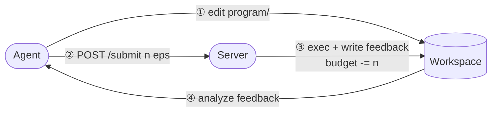

<p align="center">
  
</p>

<h1 align="center">EvoPolicyGym</h1>

<p align="center">
  Evaluation and rollout infrastructure for coding agents that evolve
  executable policies.
</p>

<p align="center">
  <a href="https://github.com/Linzwcs/EvoPolicyGym/actions/workflows/ci.yml"></a>
  <a href="https://linzwcs.github.io/EvoPolicyGym/docs/"></a>
  <a href="https://www.python.org/downloads/release/python-3120/"></a>
  <a href="https://arxiv.org/abs/2607.02440"></a>
  <a href="https://github.com/Linzwcs/EvoPolicyGym/tree/v0.1.0"></a>
  <a href="LICENSE"></a>
</p>

EvoPolicyGym is infrastructure for evaluating coding agents and generating
training experience through **Autonomous Policy Evolution**. It brings
heterogeneous interactive environments under a common Benchmark contract,
compares Agents under fixed Episode budgets, and records reproducible Runs of
Programs, Submissions, Feedback, and outcomes.

These Runs support both fair evaluation and the construction of rollout
datasets for downstream RL and other post-training methods. Policies act
within Episodes; Agents improve them between Evaluations by designing
experiments, allocating resources, and editing code.

The paper implementation and Core16 results are preserved at
[`v0.1.0`](https://github.com/Linzwcs/EvoPolicyGym/tree/v0.1.0); they are
historical research artifacts, not outputs of the current 0.3 Kernel.

## How it works



The Agent can edit the Program, inspect public Feedback, and submit or finish
through its scoped Session client. The Host owns the Episode pool, budget,
Evaluation lifecycle, private final selection, and retained evidence.
The Host task declares `evopolicygym-session submit` as the Agent's only
authorized Benchmark Environment interaction path; directly running a local
Benchmark implementation, environment provider, simulator, ROM, or equivalent
mechanism is forbidden and does not constitute a budgeted experiment.

### Active experimentation under a budget

Every Run gives the Agent a fixed Episode budget and a deterministic pool of
selectable Episode identities. The Agent actively allocates this budget
between exploration, comparison, and confirmation. Reusing an Episode index
enables a matched comparison between Programs, but every use creates a fresh
Environment and Policy runtime and consumes another budget unit. The
underlying scenarios and seeds remain Host-owned. Validation and Assessment
use separate private allocations after the Agent has finished.

Episode budget makes interaction efficiency comparable within one Benchmark;
it is not a cross-Benchmark measure of compute cost.

## Quickstart

EvoPolicyGym requires Python 3.12 and
[`uv`](https://docs.astral.sh/uv/) 0.11.16. Clone the repository and install the
independent CartPole Benchmark:

```console
git clone https://github.com/Linzwcs/EvoPolicyGym
cd EvoPolicyGym
uv sync --project environments/gymnasium/classic_control/cartpole --extra dev
```

Run one deterministic Evaluation of its packaged baseline:

```console
uv run --project environments/gymnasium/classic_control/cartpole python - <<'PY'
from cartpole import CartPoleBenchmark, baseline_program
from evopolicygym import EvaluationConfig, evaluate
from evopolicygym.execution import ProcessExecution

result = evaluate(
    baseline_program(),
    CartPoleBenchmark(),
    execution=ProcessExecution.unsafe(),
    config=EvaluationConfig(episodes=5, seed=42),
)
print(result.feedback.score)
print(result.feedback.content)
PY
```

A Policy Program is an immutable snapshot of a source directory whose
`policy.py` defines `make_policy(context)`. See the
[Policy guide](https://linzwcs.github.io/EvoPolicyGym/docs/policy/) to write
one.

> `ProcessExecution` is not a sandbox. Policy and Agent processes run with the
> authority of the current operating-system user; use it only with trusted
> code. Its Agent instructions prohibit out-of-Session Environment interaction,
> but this is a normative prompt rule rather than an isolation guarantee.

## Run a coding agent

After authenticating the Codex CLI, start a small budgeted CartPole Run:

```console
mkdir -p runs
uv run --project environments/gymnasium/classic_control/cartpole \
  python scripts/run_cartpole_codex.py \
  --model gpt-5.6-luna \
  --reasoning-effort high \
  --record-to runs/cartpole-001 \
  --max-submissions 3 \
  --episode-budget 30 \
  --episode-pool-size 60 \
  --max-episodes-per-submission 10 \
  --validation-episodes-per-candidate 5 \
  --assessment-episodes 10 \
  --allow-unsafe-process
```

Public Evaluation and Run workflows use the Python SDK. During one active Run,
the Agent-facing `evopolicygym-session` command provides only two capabilities:

```python
from evopolicygym.run import RunConfig, run
```

`run()` is owned by the `evopolicygym.run` use-case package and is not exported
from the root package, avoiding a function/submodule name collision.

```console
evopolicygym-session submit program --episodes "0:2,4:8"
evopolicygym-session finish submission-000002 submission-000003
```

`submit` requests an experiment over selected Run-local Episode indices.
`finish` hands published candidates to the Host and permanently closes Agent
authority before private Validation and Assessment.

For AI-assisted setup, SDK usage, provider integration, Benchmark authoring,
and Run diagnostics, use the reusable
[`evopolicygym` Agent Skill](skills/evopolicygym/).

## Benchmarks

Benchmark distributions are independent packages built on the public
EvoPolicyGym authoring API.

| Collection | Coverage |
| --- | --- |
| [ARC Prize / ARC-AGI-3](environments/arcprize/arc_agi_3/) | All 25 version-pinned public interactive games plus custom collections |
| [AtCoder AHC](environments/atcoder/) | AHC054, AHC057, and AHC058 |
| [CodeChef Challenges](environments/codechef/) | WAREHOUS |
| [Gymnasium Box2D](environments/gymnasium/box2d/) | LunarLander, BipedalWalker, and CarRacing |
| [Gymnasium Classic Control](environments/gymnasium/classic_control/) | CartPole, Acrobot, Mountain Car, and Pendulum |
| [Gymnasium MuJoCo](environments/gymnasium/mujoco/) | All eleven current `v5` tasks |
| [Gymnasium Toy Text](environments/gymnasium/toy_text/) | Blackjack, CliffWalking, FrozenLake, and Taxi |
| [MiniGrid and BabyAI](environments/minigrid/) | Standard MiniGrid families, all 22 WFC presets, and 40 BabyAI tasks |
| [HighwayEnv](environments/highway_env/) | All ten canonical single-agent tasks |
| [Gymnasium-Robotics](environments/gymnasium_robotics/) | Fetch, Maze, Adroit, Shadow Hand, and FrankaKitchen profiles |
| [MetaWorld](environments/metaworld/) | All 50 MT1 tasks, MT10, MT50, and custom collections |
| [ALE](environments/ale/) | Redistributable Tetris profile |
| [ViZDoom](environments/vizdoom/) | 12 wheel-bundled standard scenarios |
| [Stable-Retro](environments/stable_retro/) | Redistributable Airstriker Level 1 profile |
| [Jackdaw](environments/jackdaw/) | Balatro |
| [Core16](https://linzwcs.github.io/EvoPolicyGym/results/) | Historical `v0.1.0` paper suite |

See the [environment catalog](environments/) and
[integration ledger](environments/STATUS.md) for complete coverage.

## Author a Benchmark

External distributions implement the structural `Benchmark` and `Environment`
interfaces from `evopolicygym.authoring`. A Benchmark owns deterministic
Episode planning, scoring, sanitized Feedback, and public Artifacts; an
Environment owns reset, step, and cleanup behavior. Typed environment
configuration is fixed before a Run and recorded in the Benchmark identity.

Use `check_benchmark()` before distribution. See the
[authoring guide](https://linzwcs.github.io/EvoPolicyGym/docs/authoring/) and
the [CartPole](environments/gymnasium/classic_control/cartpole/) or
[FrozenLake](environments/gymnasium/toy_text/frozen_lake/) packages.

## Development

```console
uv sync --extra dev
uv run ruff check src tests
uv run mypy
uv run python -m unittest discover -s tests
uv build
```

EvoPolicyGym 0.3 is an alpha release and does not provide process isolation,
crash recovery, or Run resumption. Read [CONTRIBUTING.md](CONTRIBUTING.md) and
[SECURITY.md](SECURITY.md) before changing runtime behavior.

## Citation

The paper and reported experiments correspond to the
[`v0.1.0`](https://github.com/Linzwcs/EvoPolicyGym/tree/v0.1.0) research
implementation:

```bibtex
@article{wang2026evopolicygym,
  title   = {EvoPolicyGym: Evaluating Autonomous Policy Evolution in Interactive Environments},
  author  = {Wang, Zhilin and Song, Han and Zhan, Runzhe and Du, Jusen and
             Chen, Jiacheng and Li, Tianle and Yin, Qingyu and Wu, Yulun and
             Shen, Zhennan and Zhu, Tong and Li, Yanshu and Chen, Guanjie and
             Wong, Derek F. and Li, Yafu and Cheng, Yu and Yang, Yang},
  journal = {arXiv preprint arXiv:2607.02440},
  year    = {2026},
  doi     = {10.48550/arXiv.2607.02440}
}
```

## License

The EvoPolicyGym Kernel is released under the [MIT License](LICENSE).
Environment distributions may include separately attributed dependencies; see
their package documentation for details.

## Acknowledgements

EvoPolicyGym was directly inspired by Jiayi Weng's
[Learning Beyond Gradients](https://trinkle23897.github.io/learning-beyond-gradients/#zh).
We thank the author for articulating the idea of heuristic learning: coding
agents can learn from rewards, failures, tests, logs, and replays, then express
what they learn as an improved executable strategy system.
