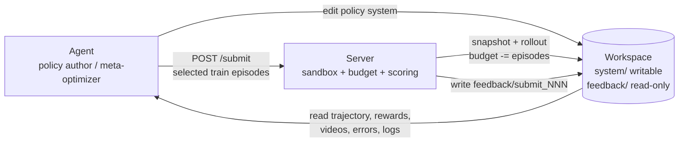
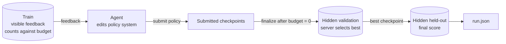

# EvoPolicyGym Protocol Design: Evaluating Agents as Policy-System Optimizers

> Working draft. 目标是用比论文更直接的方式解读 EvoPolicyGym 的完整协议设计思想：为什么要评估 agent 写 policy system，为什么公平性的核心是环境交互预算，为什么用 Gym-style 抽象，以及 Agent / Workspace / Server / train-validation-held-out 这套协议如何保证可比较性。

## 0. 为什么要评估 agent 写 policy system

很多 agent 评测问的是：模型能不能一次性给出正确答案。EvoPolicyGym 关心的是另一个问题：

> Can an agent use environmental feedback to build a better decision-making policy system?

现实中的许多任务不是一次性问答，而是连续决策过程。例如控制机器人、玩游戏、做实验、调度资源、设计运营策略，都不是输出一句话就结束。它们更像是一个循环：

1. 观察当前状态；
2. 做出一个行动；
3. 环境发生变化；
4. 收到反馈；
5. 基于新状态继续决策。

当然，我们可以让一个通用 agent 直接承担这个循环：每一步都观察环境、思考、调用工具、选择动作。但在很多现实系统里，这会带来高开销和高延迟。机器人控制、在线调度、游戏 bot、交易或运营策略，都需要一个可以实时运行、稳定复现、低成本执行的决策系统，而不是每一步都等待一个大模型 agent 重新推理。

因此，更实际的设定是：agent 不直接代替系统做每一个动作，而是编写、维护和改进一个可以实时运行的 policy system。这个 policy system 与环境交互，承担低延迟决策；agent 则根据环境反馈、日志、失败案例和评测结果，在外层优化这个 policy system。

这也呼应 Jiayi Weng 在 [Learning Beyond Gradients](https://trinkle23897.github.io/learning-beyond-gradients/#zh) 中提出的方向：随着 coding agent 变强，值得关注的不只是用梯度更新神经网络参数，而是让 agent 通过阅读失败、编辑代码、补充测试和观察 replay 来维护一个不断改进的软件化策略系统。换句话说，policy system 负责在环境中行动，agent 作为 meta-optimizer 负责吸收反馈并更新这个系统。

因此，要评估不同 agent 在这方面的能力就显得很重要。一次性 benchmark 可以测知识、推理和指令跟随，但很难测 agent 是否能在反馈循环中改进一个可执行的行为机制。我们想评测的能力是：agent 能不能把环境反馈转化成一个更好的 policy system。

## 1. 如何公平评估这个能力

一旦我们把 agent 放在 meta-optimizer 的位置，评估协议就变得很关键。因为 agent 的表现不只取决于它最终写出的 policy system，也取决于它在优化过程中看到了多少环境反馈。如果一个 agent 可以无限次运行环境、反复试错、筛选策略，而另一个 agent 只能看少量 episode，那么最后分数就不再是公平比较。

因此，在这个场景下，公平性的核心首先是控制环境交互次数。每一次 rollout 都是有价值的信息：它告诉 agent 当前 policy 在哪些状态失败、哪些动作有效、reward 如何变化、episode 为什么提前结束。更强的 agent 应该是在相同或可比较的环境交互预算下，把这些反馈更有效地转化成 policy improvement。

这也是为什么 EvoPolicyGym 把 episode budget 作为主预算。公平比较需要给不同 agent 相同或可比较的总环境交互预算，但协议不应该规定每次实验必须花多少预算。Agent 作为 expert / meta-optimizer，应该自己判断如何使用预算：什么时候先小规模试探，什么时候扩大测试，什么时候重复某些困难 case，什么时候停止一个方向并切换策略。

换句话说，预算不是只用来限制 agent 的外部约束，也是被评估能力的一部分。一个强 agent 不只是能读懂反馈，还应该会设计实验：用少量 episode 快速定位失败模式，用更大批量验证候选 policy 是否稳定，在探索新想法和确认已有改进之间做取舍。最终比较的是：在相同总预算下，哪个 agent 更会把有限环境交互转化成最终更好的 policy system。

Agent 可以自由决定如何分析反馈、如何修改代码、何时提交、一次提交跑哪些 train cases；但所有真实环境交互都必须通过受控的 submit-feedback 通道发生，并且按 episode 计入预算。

当然，交互次数不是唯一的公平约束。协议还需要保证：

- 所有 agent 面对相同的任务描述、观测空间、动作空间和训练 case 接口；
- agent 只能看到 visible train feedback，不能看到 hidden validation 或 held-out cases；
- agent 不能绕过 server 在本地额外运行环境或复制 simulator 来获得预算外 rollout；
- hidden validation 只用于选择 checkpoint，held-out 只用于最终报告；
- 最终比较的是相同预算下，agent 能否产出泛化更好的 policy system。

换句话说，新的评估协议要把“学习机会”本身纳入控制变量，同时把“如何使用学习机会”留给 agent。在相同环境反馈预算下，哪个 agent 更会设计实验、分配预算，并把反馈变成可执行的策略改进。

## 2. Gym 是什么

为了评估这种能力，我们需要一套能够覆盖不同交互任务的统一抽象。Gym-style environment 正是这样的抽象：它把各种连续决策问题建模成同一类接口，而不是为每个任务单独设计一套评测逻辑。

它的核心不是“游戏”，而是一个简单的交互循环：

```text
observation -> action -> reward / feedback -> next observation
```

一个 policy 在 episode 中反复执行这个循环：

1. 环境给出当前 observation；
2. policy 选择 action；
3. 环境执行 action，更新状态；
4. 环境返回 reward、next observation，以及 episode 是否结束；
5. 多步交互组成一条 trajectory；
6. trajectory 上累积得到 return。

因此，Gym-style 环境评测的不是孤立动作，而是一串决策在整个 episode 上产生的结果。

引入 Gym-style 抽象的价值不只是方便跑游戏。更重要的是，它让不同类型的现实任务可以被规范地建模、扩展和比较：

- 对机器人控制，observation 可以是传感器状态，action 可以是控制指令，reward 可以描述任务完成度和安全约束；
- 对游戏或模拟器，observation 是游戏状态，action 是操作，reward 是分数或进度；
- 对调度和运营策略，observation 可以是资源、队列、需求和约束，action 是分配或调度决策，reward 是成本、吞吐或服务质量；
- 对实验设计，observation 是已有实验结果和状态，action 是下一次实验配置，reward 是信息增益或目标指标改善。

只要任务能被表达成 observation、action、feedback 和 episode，就可以接入同一套评估协议。这带来几个直接好处：

- 任务可以不断扩展，而不需要重写 benchmark 的核心协议；
- agent 和 policy 的接口保持稳定，便于比较不同系统；
- 反馈、预算、checkpoint、hidden validation、held-out scoring 等机制可以统一；
- 不同环境之间的结果更容易组织成 suite，而不是一组互不兼容的单点测试。

所以，Gym-style 环境在这里不是一个窄的游戏 benchmark，而是一种现实交互任务的建模层。它把复杂任务压缩成可执行、可重复、可度量的序列决策问题，为后面的公平协议提供共同基础。

## 3. EvoPolicyGym 的协议

Gym-style 抽象告诉我们如何表示一个交互式任务，但要公平评估 agent 作为 policy system optimizer 的能力，还需要一套协议来规定：谁能运行环境、谁能看到反馈、预算如何扣、最终分数如何产生。

EvoPolicyGym 的协议可以简化成三个角色：

```text
Agent      edits policy system and decides experiments
Workspace  exposes editable system/ and read-only feedback/
Server     runs rollouts, writes feedback, controls budget and scoring
```



一次迭代是：

```text
agent edits system/
agent submits selected train episodes
server snapshots and runs the policy in sandbox
server writes feedback/submit_NNN/
agent reads feedback and edits again
```

这里最重要的设计是职责分离。Agent 负责写 `system/policy.py`、分析反馈、决定何时提交以及一次提交跑哪些 train cases。Server 负责真正执行环境、扣 episode budget、写 feedback、保存 checkpoints，并在预算耗尽后自动完成 hidden validation 和 held-out scoring。Workspace 只是共享界面：`system/` 对 agent 可写，`feedback/` 对 agent 只读。

这套协议保留了 agent 的自由度，但控制了学习机会。Agent 可以用规则、搜索、规划、神经网络、诊断打印或任何代码结构来写 policy system；也可以自己决定预算如何分配。但是所有真实环境交互必须通过 `/submit` 发生，不能在本地额外运行 Gymnasium、MuJoCo、Box2D、highway 或复制的 simulator 来获得预算外 rollout。

Agent 在优化过程中能看到的是 visible train feedback。每次 submit 后，server 会写出 `summary.json`、逐步 `trajectory.jsonl`、可选视频、lossless observation 文件、stdout/stderr 和错误信息。这些反馈足够让 agent 诊断 policy 为什么失败、在哪些状态失败、动作和 reward 如何变化。

最终评分则由隐藏 split 保证：

- **Train**：agent 可见，按 `env_instance` ID 选择，消耗 episode budget，用于迭代改 policy；
- **Validation**：agent 不可见，预算耗尽后 server 对所有成功 checkpoint 统一评估，用来选择 best checkpoint；
- **Held-out**：agent 不可见，只对 best checkpoint 做最终评估，产生 final score。



这个流程让我们可以回答一个更清楚的问题：在相同的 visible train feedback budget 下，哪个 agent 更能设计实验、分配预算、改进 policy system，并最终在 hidden held-out cases 上泛化。

## 4. 协议设计思想总结

EvoPolicyGym 的协议设计可以概括成五个原则。

第一，评估对象不是单步 action，而是 agent 能否把环境反馈转化成可执行的 policy system。Policy system 在环境中实时决策，agent 在外层作为 policy author / meta-optimizer 负责更新它。

第二，公平性的核心是环境交互预算。Episode 是学习机会的计量单位，所以协议固定总 `episode_budget`；但每次提交跑多少 episode、跑哪些 train cases、何时做小规模试探或大规模验证，都交给 agent 自己决定。预算分配本身就是被评估能力的一部分。

第三，协议方法无关，但 rollout 受控。Agent 可以用任何代码结构和优化方法写 policy system，但所有真实环境交互必须经过 server 的 `/submit` 和 `feedback/`，不能通过本地额外 simulator 获得预算外信息。

第四，优化信号和评分信号分离。Agent 只看到 visible train feedback；hidden validation 只在预算耗尽后用于 checkpoint selection；hidden held-out 只用于最终报告。这样可以区分“会不会利用反馈改进 policy”和“改进是否真的泛化”。

第五，Gym-style 抽象让协议可扩展。只要一个任务能表达成 observation、action、feedback、episode，它就可以接入同一套 Agent / Workspace / Server 协议，复用预算、反馈、checkpoint 和 hidden split 机制。这样 EvoPolicyGym 不是一组零散任务，而是一套可以持续扩展的评估框架。

这篇解读的重点不是给出 leaderboard，也不是介绍某个具体环境，而是说明：当我们把 agent 看作 policy system 的优化器时，评估协议本身必须控制学习机会、隔离隐藏评估、保留 agent 的实验设计自由，并用统一环境抽象支撑可扩展任务集合。

尤其是在低 budget 设置下，这种评估更能凸显 agent 作为优化器带来的价值。协议并不限制 agent 使用什么方法：它可以写规则、做搜索、加规划，也可以在 policy system 里尝试 RL 或学习组件。但如果 agent 在很少的 episode budget 下选择依赖大量 rollout 的 RL 训练，通常很难收敛，也很难把有限反馈有效转化为最终表现。此时真正被测量的不是“是否允许 RL”，而是 agent 是否能判断当前预算适合什么优化策略：能否利用先验知识、阅读失败轨迹、设计小实验、定位关键错误，并把少量反馈快速转化为 policy system 改进。
