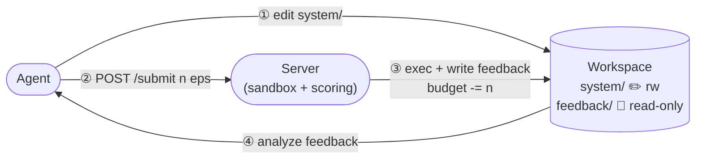
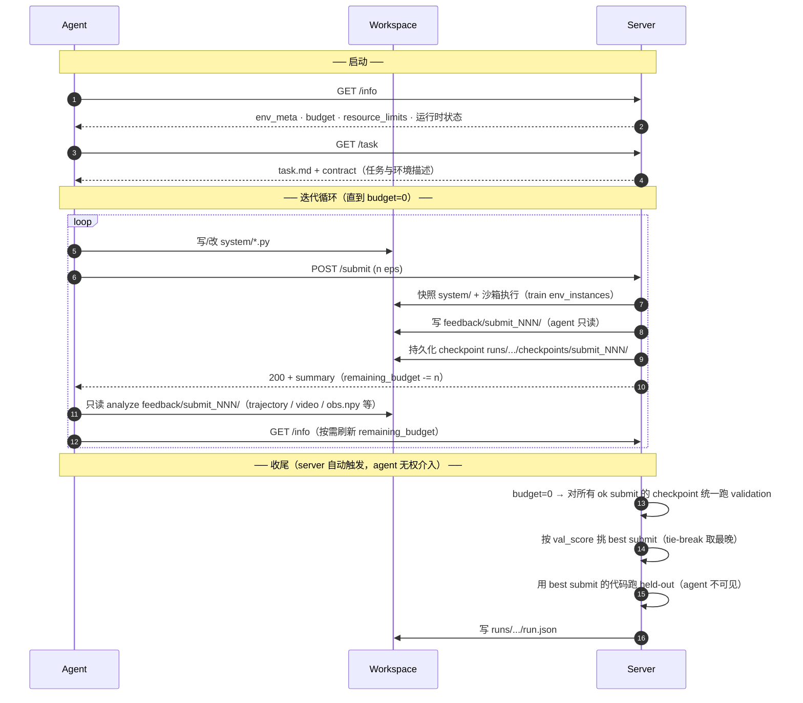
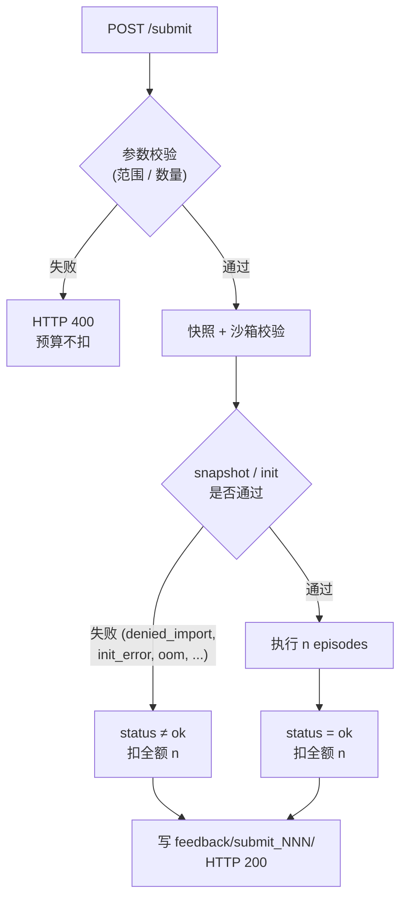
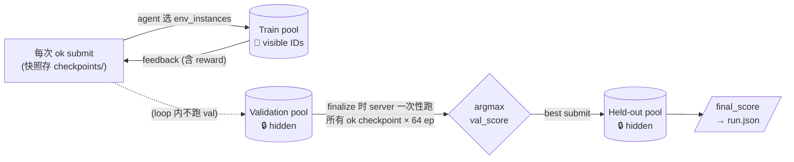

← [protocol index](./README.md)

# §1 评测流程纵览

> 本章刻画 *谁是谁 / 怎么连 / 钱怎么算 / 最终分怎么出*。

## 1.1 简介

EvoPolicyGym 评测 **agent 从环境反馈中迭代代码策略（方法不限）** 的能力：

- **闭环**：agent 写代码 → server 沙箱执行 → 写回反馈 → agent 据此改代码，反复。
- **预算受限**：每个 run 有固定 `episode_budget`；agent 自决分配。
- **方法不限**：agent 提交的是 Python 代码，内部用 PD / PPO / 搜索 / 规划 / NN 均可。
- **三层 case 池**：**train**（agent 可见，按 `env_instance` ID 索引，迭代用）→ **validation**（隐藏，server 用来选 "best 提交"）→ **held-out**（隐藏，给 best 策略打最终分）。Validation 与 held-out 都对 agent 不可见。

## 1.2 三方角色与核心评测流程

整套协议只有三个概念：**Agent**、**Server**、**Workspace**。



一个迭代周期就是 **① → ② → ③ → ④**，重复直到预算耗尽（budget=0 后由 server 自动 finalize，agent 无 finalize 权限）。

- **Feedback 落地与读取**：每次 submit 完成，server 把 summary 与详情（trajectory / video / obs.npy 等）写入 `feedback/submit_NNN/`；agent **从 workspace 只读分析**（`POST /submit` 的 HTTP 响应同时回带 summary，便于即时判断状态，与盘上 `summary.json` 字节一致）。
- **运行时状态走 `GET /info`**：剩余 budget、submit 计数、是否已 finalize 都从这里查；agent 不应自行推算。
- **任务与环境描述走 `GET /task`**：env 本地的 `task.md`（任务目标、观测/动作空间、reward 设计、评分约定）加上统一 policy/submit contract 后从此端点拉取，不落盘到 workspace。
- 环境、held-out 评估、`run.json`、finalize 触发逻辑都封装在 Server 内部，协议外部不可见。

职责分工：

| 角色 | 负责 | 不负责 |
|---|---|---|
| **Agent** | 写 `system/policy.py`、决定何时 submit、analyze `feedback/`（只读） | 执行环境、不可见 held-out、不能写 `feedback/`、**不能触发 finalize** |
| **Server** | 快照 → 沙箱执行 → 写 `feedback/`（同时回带 summary 至响应体）→ budget=0 时自动 finalize：**对所有 `status == ok` 的 checkpoint 跑 validation → 按 val 分挑 best → 跑 held-out → 打分** | 不指挥 agent 用什么方法、不改 agent 代码 |
| **Workspace** | 共享 FS：`system/` agent 可写、`feedback/` 仅 server 可写 agent 只读 | 不持有任务描述（仅经 `GET /task` 暴露） |

读写权责（**MUST**）：

| 路径 | Agent | Server |
|---|---|---|
| `system/` | read + write | 仅快照读，**禁止修改** |
| `feedback/submit_NNN/` | **read-only**（写入即破坏协议） | 写入（每次 submit 后 atomically 落盘） |
| `AGENTS.md` | read | run start 时 staging；之后不修改 |

### Feedback 详情清单

每次 submit 在 `workspace/feedback/submit_NNN/` 下产出以下工件，agent 全部 **只读** 消费。

```
feedback/submit_NNN/
├── summary.json                       # submit 总览（必有）
├── errors.txt                         # 仅 status ≠ ok 时
└── episodes/
    └── ep_<XXX>/                      # 每个执行的 episode 一个目录（XXX = run-global 编号）
        ├── trajectory.jsonl           # 整个执行过程逐步记录（必有）
        ├── observations.npy / .npz    # 仅 obs_storage == external（pixel 等大 obs）
        ├── video.mp4                  # 仅 env 支持渲染
        ├── stdout.txt                 # policy 自身 print（必有，可空）
        ├── stderr.txt                 # policy 自身 stderr（必有，可空）
        └── error.txt                  # 仅本 episode 中途失败
```

| 工件 | 内容 |
|---|---|
| **`summary.json`** | submit 级聚合：`status`、`n_episodes`、`env_instances`、`returns[]`、`mean/std/min/max_return`、`episode_lengths[]`、`timeouts[]`、`errors[]`、`reward_components_mean / *_per_episode`、`wall_time_seconds`、`remaining_budget` |
| **`trajectory.jsonl`** | **整个策略执行过程**，逐步一行：`t`、`obs`、`action`、`reward`、`terminated`、`truncated`、`info`、`reward_components`（如 env 声明）。**每一步的 reward 都在**，可直接还原决策序列与回报曲线。 |
| **`video.mp4`** | **可视化视频**（H.264，1 帧 = 1 步，与 `trajectory.jsonl` 行数严格对齐），给人看用；像素有损，**不要当数据源**。 |
| **`observations.npy / .npz`** | pixel / 大 obs 的 lossless 二进制旁路；shape 为 `[episode_length, *obs_shape]`，与 `trajectory.jsonl` 同序对齐。 |
| **`stdout.txt` / `stderr.txt`** | policy 在本 episode 内自己 `print` / `warnings.warn` 的内容；agent 用来植入诊断信息后下一轮自取。 |
| **`error.txt`**（per-episode） | 该 episode 中途 `act_error` / `reset_error` 的 traceback（JSON Lines）。 |
| **`errors.txt`**（submit-level） | submit 整体失败原因（`denied_import` / `init_error` / `oom` / `rollout_timeout` 等）；与 `episodes/` 互斥（详见 [§4](./04-feedback.md) / [§5](./05-submit-lifecycle.md)）。 |

要点：

- **逐步信号**：每个 step 的 `reward`、`reward_components`、`obs`、`action`、`terminated/truncated` 都在 `trajectory.jsonl`；agent 想做 reward shaping 诊断、状态分析、回报曲线都从这里取。
- **轨迹与视频严格对齐**：`trajectory.jsonl` 的 N 行 ⟺ `video.mp4` 的 N 帧 ⟺ `observations.npy[N]`，三者下标互通，便于 agent 在视频里定位失败步并跳到对应轨迹行。
- **大文件不进 HTTP**：HTTP `/submit` 响应只回 `summary.json` 内容；trajectory / video / obs.npy 体积可能上百 MB，仅落到 workspace。
- **错误显式化**：失败/timeout 不是吞掉，而是落到 `error.txt`（per-episode）或 `errors.txt`（submit-level），agent 可读 traceback 自行修。

## 1.3 一次 run 的生命周期



## 1.4 控制面：3 个 HTTP 接口

Agent **必须** 通过 HTTP 与 server 交互（Python lib 仅供 server 内部 / 测试）。Agent 仅有 3 个端点，**没有 `/finalize`** —— 收尾由 server 在 `remaining_budget == 0` 时自动触发。

| Endpoint | Method | 用途 | 关键返回 |
|---|---|---|---|
| `/info` | GET | **运行时状态查询**：剩余 budget、submit 计数、是否已 finalize、env_meta、资源/导入约束 | `state.remaining_budget`、`state.n_submits`、`state.is_finalized`、`env_meta`、`episode_budget`、`min/max_episodes_per_submit`、`resource_limits`、`allowed_imports` / `denied_imports` |
| `/task` | GET | **任务与环境描述**：env 的 `task.md`（任务目标 / obs & action 空间 / reward 设计 / 评分约定）加统一 policy/submit contract | `text/markdown` 全文 |
| `/submit` | POST | **同步提交并返回 summary**：传入 `env_instances`（`int[]` 或 spec 字符串，详见 [§1.5](#15-预算模型)），server 沙箱执行后回带 summary；详情大文件落地 `feedback/submit_NNN/` 供 agent 只读 analyze | `submit_id`、`status`、`summary`（与 `feedback/submit_NNN/summary.json` 字节一致） |

**故意不暴露给 agent**：validation / held-out 大小 / 种子 / 结果、`expert_baseline` / `random_baseline`、真实 seed 值（agent 只见 train env_instance 整数 ID）、finalize 触发权 + best 选择权（均 server 内部，budget=0 时按 val_score 自动挑）。

## 1.5 预算模型

### 计量与配置

`episode` 是预算的最小单位；`POST /submit` 的 `env_instances` 展开后的长度即本次申请消耗的 episode 数。

| 字段（`GET /info` 暴露） | 含义 |
|---|---|
| `episode_budget` | 全 run 总额度（不可变） |
| `min_episodes_per_submit` | 单次 submit 最少 episode 数 |
| `max_episodes_per_submit` | 单次 submit 最多 episode 数 |
| `state.remaining_budget` | 剩余额度（每次 submit 后刷新） |

#### `env_instances` 输入格式

`POST /submit` body 的 `env_instances` 字段接受两种形态（**MUST** 同时支持）：

| 形态 | 例 | 等价展开 |
|---|---|---|
| `int[]`（旧式） | `[7, 8, 9, 10, 16, 17, 18, 19, 20]` | 本身 |
| `string` spec | `"7-10,16-20"` | `[7, 8, 9, 10, 16, 17, 18, 19, 20]` |

Spec 字符串语法（**MUST**）：

- 逗号分隔 token；token 为单整数（`5`）或闭区间 `lo-hi`（`7-10` ⟺ `[7, 8, 9, 10]`，**两端都包含**）
- 空白容忍：`"7-10, 16-20, 90-100"` 合法
- **顺序保留**：`"5,3,1"` 即按此序跑 3 个 episode
- **重复保留**：`"5,5,5"` 即 3 个独立 episode（与 v1 行为一致；详见下方扣费规则）
- 混合合法：`"7-10,11,12,13,16-20"` ⟺ `[7,8,9,10,11,12,13,16,17,18,19,20]`

解析失败（非法 token、`hi < lo`、负数等）→ HTTP 400 `budget_invalid`，预算不扣。

单次 submit 必须满足（**针对展开后的列表**）：

```
min_episodes_per_submit ≤ len(expanded) ≤ min(max_episodes_per_submit, remaining_budget)
```

不满足 → HTTP 400 `budget_invalid`，**预算不扣**。

### 扣费规则



关键规则（**MUST**）：

1. **参数级失败不扣**：`env_instances` 越界或数量违规 → HTTP 400，预算不动。
2. **执行级失败仍扣**：进入快照阶段后任何失败（`denied_import` / `init_error` / `oom` / `rollout_timeout` 等）都扣全额 `len(env_instances)`。
3. **每个 episode 算一次**：重复 ID 也独立扣费（`[5, 5, 5]` 或 spec `"5,5,5"` 都展开为 3 个 episode、扣 3）。重叠区间同理：`"5-7,6-8"` ⟺ `[5,6,7,6,7,8]` 扣 6。
4. **不去重、不限速**：server 不做隐式优化；预算花完为止。
5. **自动 finalize + val-based 选择（finalize 时统一跑）**：`remaining_budget == 0` 时 server **MUST** 按以下顺序自动执行：
   1. 候选集 = 所有 `status == ok` 的 submit 的 `checkpoint`（持久化在 `runs/.../checkpoints/submit_NNN/`）；
   2. **统一**对每个候选 checkpoint 在 validation 集（64 个隐藏 seed）上跑一遍，得到 `val_score`；
   3. 按 `val_score` 取 argmax 选 best submit，**val_score 平分时取 `submit_index` 最大者（最晚）**；
   4. 用 best submit 的代码在 held-out 上评估，得到 `final_score`；
   5. 写 `runs/.../run.json`。

   候选集为空（无任何 `status == ok` 的 submit）时，跳过 step 2-4，直接 `final_score = 0`、`run.json:outcome.status = "no_ok_submit"`。Agent 无 `/finalize` 端点、不参与 best 选择，也无法观察 `val_score`。

   **why finalize 统一跑而非 per-submit**：(a) agent 中途丢弃的尝试不浪费 val 算力；(b) val 永远不和 submit 流水线交叉，时序上保证 val 结果不可能泄漏给 agent；(c) 总开销有上界 `n_ok_submits × 64` 个 episode，可预测。

### 预算守恒

```
episode_budget
  = remaining_budget(at finalize)
  + Σ_over_all_submits len(expanded env_instances)   ← 含执行级失败，但不含参数级拒绝
```

## 1.6 三层 case 池与最终分流程



| 池 | 大小 | Agent 可见性 | 占 agent 预算 | 何时跑 | 用途 |
|---|---|---|---|---|---|
| **Train** | `env_meta.n_env_instances`（env 自定，agent 可见） | 见 ID 与全量 feedback | ✅ 占 `episode_budget` | 每次 `POST /submit` | 给 agent 反馈用于改代码 |
| **Validation** | **64**（协议默认；agent 完全不可见） | 完全隐藏（大小 / 种子 / 结果均不暴露） | ❌ server 自费 | **finalize 时一次**，对所有 `status == ok` 的 checkpoint 统一跑 | 给 server 选 best submit |
| **Held-out** | **256**（协议默认；agent 完全不可见） | 完全隐藏 | ❌ server 自费 | finalize 时一次（仅对 best submit） | 给 best submit 打最终分 |

三池 seed **互斥（disjoint）**，均由 env author 在 env 注册期固定（绑定 `env_version`），不跨 run 变化（详见 [§6](./06-seeds-sandbox.md)）。

**Tie-break 与边界**（与 1.5 规则 5 对齐）：
- val_score 平分 → 取 **最晚** 的 submit（`max(submit_index)`），奖励持续迭代。
- 无任何 `status == ok` submit → `final_score = 0`，`run.json:outcome.status = "no_ok_submit"`。

---

← [protocol index](./README.md)　|　Next: [§2 Policy 接口](./02-policy.md) →
