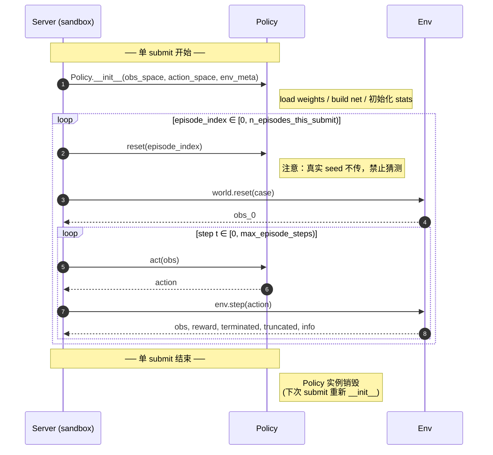
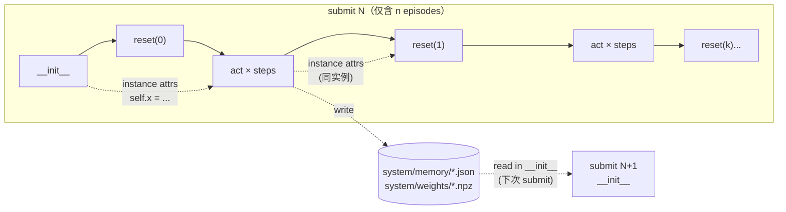

← [protocol index](./README.md)　|　← Previous: [§1 评测流程纵览](./01-overview.md)

# §2 Policy 接口

> 本章刻画 *policy 类长什么样、生命周期与状态、能 import 什么、错了怎么算*。

## 2.1 唯一入口

**`workspace/system/` 是一个完整的 agent 项目目录**，agent 自由组织子模块、权重、配置、缓存、自测脚本。协议唯一的强约束是：根部必须存在 `policy.py`，并且顶层导出名为 `Policy` 的类。

```
workspace/system/                    # 整个 agent 项目，agent 自由组织
├── policy.py                        # ✅ 必有：唯一入口，顶层导出 class Policy
├── controllers/                     # 例：策略子模块
│   ├── __init__.py
│   ├── pid.py
│   └── mpc.py
├── nets/                            # 例:神经网络结构
│   └── ppo_actor.py
├── weights/                         # 例：训练好的权重
│   └── actor.pt
├── memory/                          # 例：跨 submit 持久化（自己读写）
│   ├── running_stats.json
│   └── replay_buffer.npz
├── data/                            # 例：自采集 / 预计算数据
├── utils/                           # 例：辅助
│   └── filters.py
└── tests/                           # 例：agent 自己写自己跑的单测
    └── test_pid.py
```

- **只有 `policy.py` 是协议规定的必有项**；其余路径、命名、层级都由 agent 决定。
- 子模块之间用标准 Python import（`from controllers.pid import PIDController`、`from utils.filters import lowpass`）；server 加载 `policy.py` 时已把 `sys.path[0] = workspace/system/`，整套项目是同一个 import 根（详见 §2.5）。
- `policy.py` 是入口、不是限制：weight load、配置读取、子模块装配都在 `Policy.__init__` 里发起即可。

`Policy` 类的最小契约：

```python
import numpy as np
from typing import Any, Mapping

class Policy:
    def __init__(
        self,
        obs_space: Mapping[str, Any],
        action_space: Mapping[str, Any],
        env_meta: Mapping[str, Any],
    ) -> None: ...

    def reset(self, episode_index: int) -> None: ...

    def act(self, obs) -> "action": ...
```

**方法不限**：`Policy` 内部用 PD / PPO / MCTS / A* / NN inference / 查表，server 不关心，只校验三件事：
1. `policy.py` 在 `system/` 根部、可 import；
2. 顶层导出 `class Policy`；
3. 三个方法签名兼容上文。

## 2.2 生命周期（单 submit 内）



| 方法 | 必有 | 调用时机 | 时延约定 | 关键约定 |
|---|---|---|---|---|
| `__init__(obs_space, action_space, env_meta)` | ✅ | 每 submit 开头一次 | 无协议默认 timeout | 这里 load weight / 编译 model；抛异常 → `init_error` |
| `reset(episode_index)` | ✅ | 每 episode 开头 | 只受可选 rollout timeout 包含 | `episode_index ∈ [0, n_episodes_this_submit)`；真实 seed **MUST NOT** 推断 |
| `act(obs) → action` | ✅ | 每步一次 | 只受可选 rollout timeout 包含 | 返回值 **MUST** 兼容 `action_space`；抛异常 → 用 `action_space.sample()` 顶替并终止该 episode |

`obs_space` 是 policy 输入空间：每次 `act(obs)` 收到的 observation 都应匹配
它。`action_space` 是 policy 输出空间：每次 `act(obs)` 返回的 action 都必须匹配
它。二者都是紧凑 schema dict，不是原始 Gymnasium 对象。字段解释见
[Schema Reference](./schema.md)。

**故意不提供** `on_episode_end(return, length)`：episode 级回报通过下一轮 `feedback/submit_NNN/summary.json` 给到 agent，外层 LLM 循环就是优化通道；policy 内部如要跨 episode 累计，自己在 `reset()` / `act()` 里维护。

## 2.3 `env_meta` 字段

`__init__` 收到的 `env_meta` 字典是 server 在沙箱内给 policy 的 **唯一环境信息源**（沙箱不能发 HTTP）。字段：

| 字段 | 含义 |
|---|---|
| `env` | env slug，例如 `"halfcheetah"` |
| `submit_index` | 当前 submit 的 0-based 编号 |
| `n_episodes_this_submit` | 本次 submit 将跑多少 episode |
| `remaining_budget_after` | 本次 submit 完成后预算剩多少 |
| `max_episode_steps` | 单 episode 步数上限 |
| `allowed_imports` | 允许的第三方库白名单（informational） |
| `obs_space`, `action_space` | 同 `__init__` 前两参，便于在子模块里转引用 |
| `reward_components` | env 声明的奖励分量名（dict-like，无则缺省） |

**故意不传**：`env_instances`（agent 选的 ID）、hidden ref/seed、`val_score` / `heldout` 任何信息。

Finalize-time validation / held-out 评测也使用同一 `Policy` 构造签名，但 `env_meta` **MUST NOT** 暴露 hidden pool identity 或 hidden pool size。此时 `submit_index` 仍为 checkpoint 对应的原 submit index，`n_episodes_this_submit` 仍为该 submit 当时的可见 episode 数，`remaining_budget_after` 为 `0`。Server 内部实际跑多少 validation / held-out episodes 对 policy 不可见。

## 2.4 状态持久化



| 时间尺度 | 机制 | 例子 |
|---|---|---|
| **单 episode 内** | `self.*` 直接持有 | `self.last_obs`、`self.running_stats` |
| **单 submit 跨 episode** | 同一 `Policy` 实例 → instance attrs 自动保留 | `self.episode_count += 1` 在 `reset()` 中累计 |
| **跨 submit** | `Policy` 实例销毁 → 必须 **落盘** 到 `system/` 再 `__init__` 时读回 | `self.theta = np.load("memory/theta.npy")` |

跨 submit 落盘只能写到 `workspace/system/` 内；写到别处（如 `/tmp`）下次 submit 不可见（沙箱可能换工作目录），写到 `feedback/` 是违约（read-only）。

## 2.5 Imports 与文件系统

- **Python path**：加载 `policy.py` 时 `sys.path[0] = workspace/system/`；agent 子模块按标准 Python 解析（`from controllers.pid import PIDController`）。
- **工作目录**：`Policy.__init__` / `reset` / `act` 期间 `os.getcwd() == workspace/system/`；相对路径相对 `system/` 解析（推荐用 `__file__` 派生绝对路径以稳健）。
- **第三方库**：受 `allowed_imports` / `denied_imports` 限制（详见 [§6 沙箱](./06-seeds-sandbox.md)）。agent 子模块之间的 import 不受白名单约束。
- **MUST NOT**：运行时改 `sys.path` 越权、加载 `system/` 之外的二进制、绕过 import hook。违反 → `denied_import` 或 `import_error`，submit 失败、预算扣全额。

## 2.6 错误模型（policy 可能触发的类别）

| 类别 | 触发点 | 影响范围 | 该 episode 还跑吗 | 后续 episode 还跑吗 |
|---|---|---|---|---|
| `init_error` | `__init__` 抛异常 | submit 级 | ❌ | ❌ |
| `reset_error` | `reset()` 抛异常 | 单 episode | ❌ 空 `trajectory.jsonl` | ✅ 下一个 episode 正常 `reset` |
| `act_error` | `act()` 中途抛异常 | 单 episode | ⚠️ 该步用 `sample()`、episode 终止 | ✅ |
| `rollout_timeout` | 可选 `rollout_wall_s` 超限 | submit 级 | ⚠️ 已完成 episode 保留 | ❌ 整 submit abort |

submit 级 → 整 submit `status ≠ ok`，写 `errors.txt`、预算扣全额；`rollout_timeout` 可能同时保留已完成的 `episodes/`。
episode 级 → `summary.json:status = "ok"`，对应 `ep_<XXX>/error.txt` 记录，`summary.json:errors` 数组登记本地 index。

详细 verdict 与扣费规则见 [§5 Submit 生命周期](./05-submit-lifecycle.md)。

---

← Previous: [§1 评测流程纵览](./01-overview.md)　|　Next: [§3 资源限制](./03-resources.md) →
