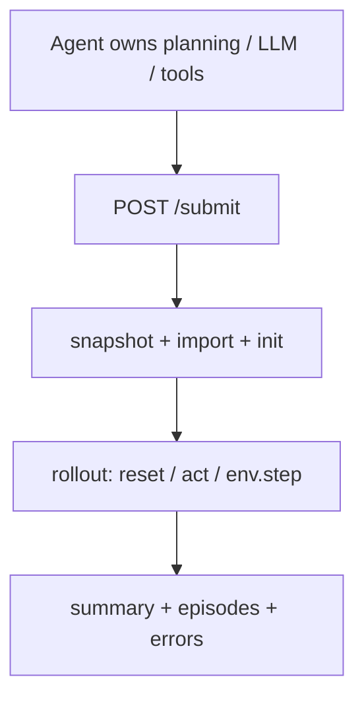
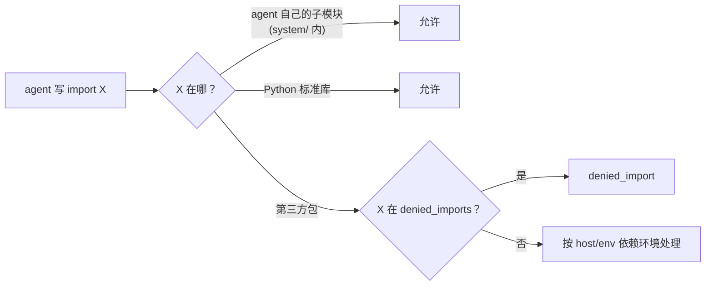

← [protocol index](./README.md)　|　← Previous: [§2 Policy 接口](./02-policy.md)

# §3 资源限制

> 本章刻画 server 接管提交后的执行边界。Agent 的 LLM 调用、思考时间、提交间隔和外层 harness timeout 不属于 EvoPolicyGym 协议，由参赛方或平台调度器管理。

## 3.1 基线原则

EvoPolicyGym 的主预算是 **episode budget**，不是时间预算。Server 只在收到 `/submit` 后执行 agent 提交的 `policy.py`，并根据请求的 `env_instances` 扣预算。

默认情况下，协议不设置 wall-time 上限：`/info.resource_limits.rollout_wall_s = null`。这避免把模型调用速度、agent 思考策略或外部工具链性能混入 benchmark 分数。

如果 host 出于工程安全需要配置 timeout，它只应限制一次 server-side rollout：训练 submit 的 execute 阶段，或隐藏 validation/final eval。它不限制 `/submit` 之前的 agent 行为，也不限制两次提交之间的间隔。

## 3.2 资源旋钮

| 类别 | 字段 | 默认值 | 作用范围 | 超限行为 |
|---|---|---|---|---|
| Rollout wall | `rollout_wall_s` | `null` | 单次 execute/eval rollout | `rollout_timeout`，扣本次 submit 全额预算；已完成 episode artifacts 保留 |
| 内存 | `memory_bytes` | `null` | sandbox 子进程 | `oom`，扣本次 submit 全额预算；已完成 episode artifacts 保留 |
| Import 黑名单 | `denied_imports` | env/host 自定 | snapshot + load | `denied_import`，扣全额 |

`null` 表示 EvoPolicyGym 不施加该限制。生产平台可以在外层再设置 job-level timeout，但该 timeout 不进入协议反馈，也不应作为 agent 能力评分的一部分。

## 3.3 Rollout 边界

规范要点：

- Agent 自由决定何时提交、提交多少次、每次提交前如何搜索或调用 LLM。
- `rollout_wall_s` 若非 `null`，只覆盖 server 执行 rollout 的窗口；默认不启用。
- `Policy.__init__` 和 import 不再有协议默认 timeout；异常仍分别映射为 `init_error` / `import_error`。
- `Policy.act()` 不设置默认 per-step timeout；如果后续 env 需要 step-level 防护，应作为 env-specific extension 明确声明。
- `summary.json.wall_time_seconds` 仍记录观测到的 submit 处理耗时，仅用于诊断，不是预算。

## 3.4 Import 策略

规则：

1. Agent 自己 `system/` 内的子模块互相 import 始终允许。
2. Python 标准库允许，但文件系统和网络能力仍由 sandbox/平台边界决定。
3. `denied_imports` 是显式拒绝列表；命中即 `denied_import`。
4. 是否提供 `allowed_imports` 白名单由具体 host 决定；若启用白名单，未列入第三方包应拒绝。

## 3.5 超限信号汇总

| 触发条件 | verdict / category | submit `status` | 扣预算 | episodes 还跑 | feedback 落点 |
|---|---|---|---|---|---|
| 导入命中 `denied_imports` | `denied_import` | ≠ ok | 是 | 否 | `errors.txt` |
| import 抛异常 | `import_error` | ≠ ok | 是 | 否 | `errors.txt` |
| `Policy.__init__` 抛异常 | `init_error` | ≠ ok | 是 | 否 | `errors.txt` |
| `reset()` 抛异常 | `reset_error` | ok | 是 | 后续 episode 继续 | `ep_<XXX>/error.txt` + `summary:errors` |
| `act()` 抛异常 | `act_error` | ok | 是 | 后续 episode 继续 | `ep_<XXX>/error.txt` + `summary:errors` |
| RSS/内存超限 | `oom` | ≠ ok | 是 | 部分保留 | `errors.txt`（可能有部分 `episodes/`） |
| `rollout_wall_s` 超限 | `rollout_timeout` | ≠ ok | 是 | 部分保留 | `errors.txt`（可能有部分 `episodes/`） |

完整 verdict 与 submit 生命周期见 [§5 Submit 生命周期](./05-submit-lifecycle.md)；sandbox 实现细节见 [§6 Case 池与沙箱](./06-seeds-sandbox.md)。

---

← Previous: [§2 Policy 接口](./02-policy.md)　|　Next: [§4 Feedback schema](./04-feedback.md) →
