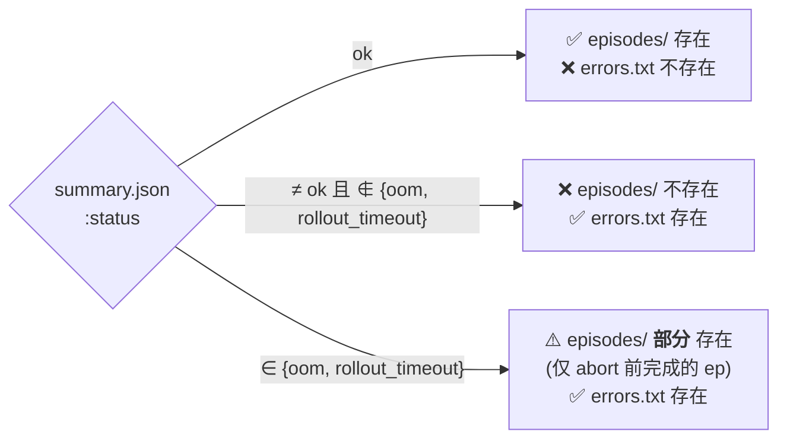
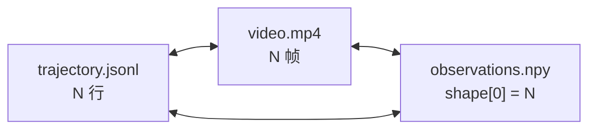

← [protocol index](./README.md)　|　← Previous: [§3 资源限制](./03-resources.md)

# §4 Feedback Schema

> 本章刻画 *每次 submit 落到 `workspace/feedback/submit_NNN/` 的所有文件长什么样、它们之间满足哪些不变量*。
>
> 前置：feedback **对 agent 整体只读**（[§1.2](./01-overview.md#12-三方角色与核心评测流程)）。本章只写 schema，不写读取协议。

## 4.1 总览

每次 submit 在 `workspace/feedback/submit_NNN/` 下产出工件，结构与必有性如下：

```
feedback/submit_NNN/
├── summary.json                       ✅ 总有（即使 status ≠ ok）
├── errors.txt                         ◯ 仅 status ≠ ok 时（与 episodes/ 互斥）
└── episodes/                          ◯ 仅 status == ok 时（与 errors.txt 互斥）
    └── ep_<XXX>/                      （每个执行的 episode 一个目录）
        ├── trajectory.jsonl           ✅ 每 episode 必有（reset_error 时可空）
        ├── stdout.txt                 ✅ 每 episode 必有（可空）
        ├── stderr.txt                 ✅ 每 episode 必有（可空）
        ├── observations.npy / .npz    ◯ 仅 env_meta.obs_storage == "external"
        ├── video.mp4                  ◯ 仅 env.render(rgb_array) 非 null
        └── error.txt                  ◯ 仅本 episode 中途失败
```

图例：✅ 总有 · ◯ 条件性

### 文件存在矩阵

| 文件 | 何时创建 | 备注 |
|---|---|---|
| `submit_NNN/summary.json` | 每次 submit | `status` 字段表示 submit 总体结果 |
| `submit_NNN/errors.txt` | `status ≠ ok` | submit-level 失败描述（JSON Lines） |
| `submit_NNN/episodes/` | `status == ok` | 装所有 `ep_<XXX>/` |
| `ep_<XXX>/trajectory.jsonl` | 每个 attempted episode | `reset_error` 时为空文件 |
| `ep_<XXX>/stdout.txt`, `stderr.txt` | 每个 attempted episode | policy 没 print 则零字节 |
| `ep_<XXX>/observations.npy` 或 `.npz` | `env_meta.obs_storage == "external"` | pixel envs |
| `ep_<XXX>/video.mp4` | env 支持 `render(rgb_array)` | 不支持渲染则**不创建**（不是空文件） |
| `ep_<XXX>/error.txt` | 本 episode 触发 `reset_error` / `act_error` | 每次失败一行 JSON |

### 互斥规则（**MUST**，含 1 处例外）



通则：`errors.txt` 与 `episodes/` 在同一 `submit_NNN/` 内互斥。  
**例外**：`status ∈ {oom, rollout_timeout}` 时两者**并存** —— Phase 6 abort 前已完成的 episode artifacts 完整保留，agent 可借此定位"是哪一步开始爆内存 / 拖时长"。详见 [§5.6](./05-submit-lifecycle.md#56-verdict--feedback-文件映射)。

## 4.2 `summary.json`（submit 级聚合）

| 字段 | 类型 | 说明 |
|---|---|---|
| `schema_version` | string | 协议版本，例 `"0.1"` |
| `submit_index` | int | 0-based，与目录名 `submit_NNN/` 一致 |
| `env` | string | env slug |
| `status` | string | 见下方枚举 |
| `n_episodes` | int | 申请且消耗的 episode 数（= `len(env_instances)`）。**失败时仍记录**（预算已扣）。 |
| `first_global_episode` | int \| null | `returns[0]` 对应的 run-global 编号；`status ≠ ok` 时为 `null` |
| `env_instances` | int[] | 申请的 ID **展开后**的执行序（即使 agent 提交的是 spec 字符串 `"7-10"` 这里也回到 `[7, 8, 9, 10]`） |
| `remaining_budget` | int | 本次 submit 完成后剩余预算 |
| `submit_started_at`, `submit_completed_at` | ISO-8601 string | UTC 时间戳 |
| `wall_time_seconds` | float | `completed - started` |
| `returns` | float[] \| null | 每 episode 的 undiscounted return，长度 `n_episodes`；`status ≠ ok` 时 `null` |
| `mean_return`, `std_return`, `min_return`, `max_return` | float \| null | `returns` 的聚合；`status ≠ ok` 时 `null` |
| `episode_lengths` | int[] \| null | 每 episode 步数；`status ≠ ok` 时 `null` |
| `mean_episode_length` | float \| null | 聚合 |
| `timeouts` | int[] \| null | 预留给 env-specific step timeout；基线协议通常为空 |
| `errors` | int[] \| null | local index 指向触发 `reset_error` / `act_error` 的 episode |
| `reward_components_mean` | object \| null | 仅 env 声明 `reward_components` 且 `status == ok` 时存在 |
| `reward_components_per_episode` | object \| null | 每分量一个 float 数组，长度 `n_episodes` |

### `status` 枚举（与 [§5 verdict](./05-submit-lifecycle.md) 同枚举）

`ok` · `budget_invalid` · `missing_policy` · `denied_import` · `import_error` · `init_timeout` · `init_error` · `invalid_env_instance` · `oom` · `rollout_timeout`

### 失败语义

`status ≠ ok` 时：所有数组字段 / 聚合字段 = `null`（**不是 `[]`**），便于 "本 submit 跑了吗？" 一次 `status == "ok"` 检查即可判定。`n_episodes` 与 `remaining_budget` 反映"已申请已扣"的预算，而非实际执行。

### 故意不在 `summary.json` 中的字段

- **`val_score`**：server 内部、agent 不可见（详见 [§1.6](./01-overview.md#16-三层-seed-池与最终分流程)）
- **`expert_baseline` / `random_baseline` / normalized score**：env-internal，仅最终 `run.json` 暴露
- **held-out 任何信息**

## 4.3 `episodes/ep_<XXX>/trajectory.jsonl`（每步轨迹）

一行一步 JSON 对象，**字段顺序固定**（便于 grep）：

```json
{"t": 0,   "obs": [...], "action": [...], "reward": 0.12, "terminated": false, "truncated": false, "info": {}}
{"t": 1,   "obs": [...], "action": [...], "reward": 0.15, "terminated": false, "truncated": false, "info": {}}
...
{"t": 998, "obs": [...], "action": [...], "reward": 0.18, "terminated": true,  "truncated": false, "info": {}}
```

| 字段 | 类型 | 含义 |
|---|---|---|
| `t` | int | 0-based 步号；`t ∈ [0, episode_length - 1]` |
| `obs` | varies \| null \| External | **传入** policy 的观测（`obs_0` 来自 `reset()`，后续来自上一 `step()`）。编码见 [Schema Reference](./schema.md)；`obs_storage == "external"` 时可为 `null`（详见 §4.5） |
| `action` | varies | policy 返回的动作（按 `action_space.type` 编码，见 [Schema Reference](./schema.md)） |
| `reward` | float | 该 transition 的标量奖励 |
| `terminated` | bool | 自然终止（达成 / 失败）。`true` 时 future return = 0 |
| `truncated` | bool | 时间步耗尽（达 `max_episode_steps`）。`true` 时 future return ≠ 0 |
| `info` | object | env 透传的辅助信息 |
| `reward_components` | object \| absent | 仅 env 声明了分量名时存在；键名与 `env_meta.reward_components` 一致 |

终止：`terminated` 或 `truncated` 任一为 `true` 时 episode 结束，`trajectory.jsonl` 不再写下一行。

### `action` 编码（按 `action_space.type`）

| `action_space.type` | JSON 形式 | 例 |
|---|---|---|
| `Discrete` | int | `"action": 3` |
| `Box` | float[]（与 `shape` 一致） | `"action": [0.1, -0.2]` |
| `MultiDiscrete` | int[] | `"action": [2, 0, 1]` |
| `MultiBinary` | 0/1 int[] | `"action": [1, 0, 1, 1]` |
| `Dict` | object | `"action": {"throttle": 0.5, "gear": 2}` |
| `Tuple` | array | `"action": [3, [0.1, 0.2]]` |

**Pre-clip**：记录的 `action` 是 **policy 返回的原值**，未经 env 端 clip。env 若 clip，可在 `info["action_clipped"]` 透传（env 自决，非协议要求）。

**NaN / Inf**：JSON 不支持原语，编码为字符串 `"NaN"` / `"Inf"` / `"-Inf"`；消费者 **MUST** 处理。

### 行数不变量

`len(trajectory.jsonl)` ⟺ `summary.json:episode_lengths[local_i]`

## 4.4 `episodes/ep_<XXX>/video.mp4`（人看用视频）

| 属性 | 值 |
|---|---|
| 容器 / 编码 | MP4 / H.264（标准 profile） |
| 帧率 | env 原生 step rate（**1 帧 = 1 步**） |
| 分辨率 | env 原生 render 分辨率，**harness 不缩放** |
| 颜色空间 | 由 env 的 `render(rgb_array)` 决定 |
| 质量 | lossy，约 CRF 22 |

**对齐不变量**（**MUST**）：



视频帧 `K` ⟺ 轨迹 `t=K` ⟺ `observations.npy[K]`：agent 用 `summary.json:errors` 找到失败 episode 与失败步 `K`，可在视频直接 seek。

**警告**：`video.mp4` 是 **lossy 压缩**，像素值不是 policy 当时看到的精确值。**不要拿来做 replay / 训练数据源**——那是 `observations.npy` 的工作。

**不存在条件**：env 没有 `render(rgb_array)` 实现时 **不创建**（不是空文件）。

## 4.5 `episodes/ep_<XXX>/observations.npy` / `.npz`（pixel 旁路）

仅 `env_meta.obs_storage == "external"` 或某个大字段外置时存在。基线整观测外置时，`trajectory.jsonl` 的 `obs` 字段为 `null`，消费者用当前行的 `t` 读取 `observations.npy[t]`；若是顶层 dict 观测，则读取 `observations.npz` 中每个 key 的第 `t` 行。嵌套观测只有部分字段外置时，该字段可使用 [Schema Reference](./schema.md) 中的 `External` 引用对象。

| 属性 | 值 |
|---|---|
| Shape | `[episode_length, *obs_shape]` |
| dtype | 与 env obs space 一致（pixel 常为 `uint8`） |
| Endianness | numpy native（`.npy` header 自描述） |
| 顺序 | `[K]` 对应 `t=K` |

**`.npy` vs `.npz`**：harness MAY 选择无压缩或压缩存储；消费者 **MUST** 同时处理：

```python
def load_obs(ep_dir):
    if (p := ep_dir / "observations.npy").exists():
        return np.load(p, mmap_mode='r')
    if (p := ep_dir / "observations.npz").exists():
        data = np.load(p)
        return {key: data[key] for key in data.files}
    raise FileNotFoundError
```

pixel envs 推荐 `.npz`（压缩率 60-80%）；`mmap_mode='r'` 允许随机访问单帧不爆内存。

## 4.6 `stdout.txt` / `stderr.txt`（policy 自身输出）

捕获 **policy 在本 episode 内** 写到 `sys.stdout` / `sys.stderr` 的全部内容（含 `warnings.warn`）。

- **范围**：仅 policy；harness 自身日志、env 警告 **不在此**（去 `runs/.../logs/`）。
- **存在性**：每 attempted episode 必有；policy 没 print 则 0 字节。
- **`__init__` 输出**：归到本 submit **首个 episode** 的 `stdout.txt`；submit-level 失败时归到 `errors.txt`。
- **上限**：每文件 64 KB；超出截尾追加 `... [truncated at 64KB] ...`。

典型用法：agent 在 policy 里 `print(diagnostic)`，下轮自己读 `stdout.txt` 取诊断。

## 4.7 错误文件（JSON Lines）

`errors.txt`（submit-level）与 `ep_<XXX>/error.txt`（per-episode）**都是 JSON Lines**（每行一个独立 JSON 对象），扩展名用 `.txt` 仅为 `cat` 友好。

### 通用 schema

```json
{
  "schema_version": "0.1",
  "timestamp": "2026-05-28T10:01:23.456Z",
  "category": "init_error",
  "message": "Policy.__init__ raised: ValueError: ...",
  "traceback": "Traceback (most recent call last):\n  File ..."
}
```

| 字段 | 说明 |
|---|---|
| `schema_version` | 每行自描述 |
| `timestamp` | ISO-8601 UTC |
| `category` | 类别枚举（下表） |
| `message` | 单行人类摘要 |
| `traceback` | 异常类回填 Python traceback；超时类为 `null` |

### `category` 枚举

| 值 | 出处 | 含义 |
|---|---|---|
| `missing_policy` | submit-level | 无 `policy.py` 或无 `class Policy` |
| `denied_import` | submit-level | 命中黑名单或未在白名单 |
| `import_error` | submit-level | import 阶段抛（语法 / 缺包 / etc） |
| `init_timeout` | submit-level | 保留给显式配置 init timeout 的非基线 runtime |
| `init_error` | submit-level | `__init__` 抛 |
| `invalid_env_instance` | submit-level | 申请的 ID 越界 |
| `oom` | submit-level | sandbox 内存超限 |
| `rollout_timeout` | submit-level | 可选 `rollout_wall_s` 超限 |
| `reset_error` | per-episode | `Policy.reset()` 抛 |
| `act_error` | per-episode | `Policy.act()` 抛 |
| `act_timeout` | per-episode | 保留给 env-specific step timeout |
| `truncated` | 两者 | 哨兵，文件被 64KB 截尾时追加 |

### Per-episode 额外字段

| 字段 | 类型 | 说明 |
|---|---|---|
| `step_index` | int \| null | 触发步号；`reset_error` 等非 `act()` 内事件为 `null` |

### 大小上限

每个错误文件 **≤ 64 KB**；超出截尾，最后一行 `category: "truncated"`、`message: "additional events omitted"`。

## 4.8 Episode 全局编号 `<XXX>`

**`XXX` 是 run-global 编号，不是 per-submit**。这让"ep_142"在跨 submit 工具里无歧义。

- **宽度**：`max(3, len(str(episode_budget)))`，与 `submit_NNN` 同宽。
- **计数器**：每 **attempted** episode +1，无论成功/失败。
  - submit-level 失败 → 计数器 **不动**，下次成功 submit 从同一编号起；
  - 单 episode 失败（`reset_error` / `act_error`）→ 计数器 **照常 +1**。
- **submit 内连续**：成功 submit 跑 `n_episodes` → 占用 `[first_global_episode, first_global_episode + n - 1]`。
- **与 `submit_NNN` 独立**：两个计数器分别推进，宽度公式相同但数值无对齐关系。

## 4.9 跨文件不变量

以下条目 **MUST** 成立，run artifact checker 应逐条校验。

| # | 不变量 | 范围 |
|---|---|---|
| F1 | `summary.json:status != "ok"` ⟺ `errors.txt` 存在；`status == "ok"` ⟺ `episodes/` 存在不含 submit-level `errors.txt`；**例外**：`status ∈ {oom, rollout_timeout}` 时 `errors.txt` 与 `episodes/`（部分）**并存**（[§5.6](./05-submit-lifecycle.md#56-verdict--feedback-文件映射)） | 每 submit |
| F2 | `status == "ok"` 时：`episodes/ep_*/` 数 = `n_episodes` | 每 submit |
| F3 | `status == "ok"` 时：目录名为 `ep_<first_global_episode + i>/`，`i ∈ [0, n_episodes)` | 每 submit |
| F4 | `len(trajectory.jsonl)` = `episode_lengths[i]` | 每 episode |
| F5 | `observations.npy` 存在时：`shape[0] = len(trajectory.jsonl)` | 每 episode |
| F6 | `video.mp4` 存在时：帧数 = `len(trajectory.jsonl)` | 每 episode |
| F7 | `ep_<XXX>/error.txt` 存在 ⟺ `local_i = XXX - first_global_episode ∈ summary:errors ∪ summary:timeouts` | 每 episode |
| F8 | `obs_storage == "external"` 时：`trajectory.jsonl` 中每个 `obs` 为 `null` | 每 episode |
| F9 | `obs_storage == "inline"` 时：**不存在** `observations.npy` | 每 episode |

## 4.10 Harness-level 崩溃

harness 进程自己挂掉（OOM / 硬件 / Ctrl-C / 磁盘满）时：

- **进行中 submit** 的 `feedback/submit_NNN/` 可能 **缺失或部分写入**；消费者 **MUST** 容忍。
- **已完成 submit** 的 `feedback/submit_NNN/` 完整（崩前已落盘）。
- `run.json:outcome.status = "error"`、`outcome.error` 描述崩溃原因。
- harness MAY 尝试清理写入，**不保证**。

**协议不保证 per-submit 原子性**对抗 harness crash —— run 整体是原子单位：要么完成出 `run.json`，要么标 `error` 整 run 作废。

---

← Previous: [§3 资源限制](./03-resources.md)　|　Next: [§5 Submit 生命周期](./05-submit-lifecycle.md) →
