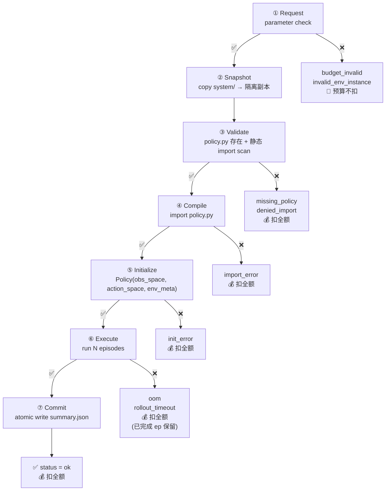

← [protocol index](./README.md)　|　← Previous: [§4 Feedback schema](./04-feedback.md)

# §5 Submit 生命周期

> 本章刻画 *一次 submit 从 HTTP 进来到 feedback 落盘，中间走哪 7 个阶段、每阶段失败对应哪个 verdict、扣不扣预算*。

## 5.1 心智模型

一次 submit = **封箱代码 → 沙箱判官 → 出 verdict + 诊断**：

- **封箱**：进入 Phase 2（Snapshot）后 `system/` 被 atomically 复制到隔离副本；agent 此后对 `system/` 的修改不再影响进行中的 submit。
- **判官**：Phase 3-6 在沙箱内跑（资源限制见 [§3](./03-resources.md)）。
- **结果**：Phase 7 落 `feedback/submit_NNN/`；`summary.json:status` 即 verdict。

与传统 OJ 不同点：

| | 传统 OJ | EvoPolicyGym |
|---|---|---|
| Verdict | AC / WA 二元 | 10 类，连续打分（held-out 决最终分） |
| 测试 | 固定输入输出对 | 有状态环境交互 |
| 互动 | 一题一交 | 多轮闭环，feedback 引导 |

## 5.2 7 阶段流程



**短路规则**（**MUST**）：任一阶段失败立即停止后续阶段；写对应 verdict + `errors.txt`，跳到 Phase 7 落 `summary.json` 后返回 HTTP 200。

## 5.3 各阶段细节

### Phase 1 — Request

参数校验（在 server，**不进沙箱**）：

1. **解析 `env_instances`** 为 `int[]`：
   - 若是 `int[]`（旧式）：原样使用。
   - 若是 `string`（spec）：按 `"7-10,16-20,90-100"` 语法展开（详见 [§1.5 `env_instances` 输入格式](./01-overview.md#env_instances-输入格式)）。
   - 解析失败（非法 token / `hi < lo` / 负数 / 空字符串）→ `budget_invalid`。
2. **逐 ID 校验**：每个展开后的 ID `∈ [0, n_env_instances)` → 否则 `invalid_env_instance`。
3. **数量校验**：`min_episodes_per_submit ≤ len(expanded) ≤ min(max_episodes_per_submit, remaining_budget)` → 否则 `budget_invalid`。

任一失败 → HTTP 400，**不扣预算**。**这是唯一的零预算拒绝阶段**。

### Phase 2 — Snapshot

`system/` 整目录递归 copy 到隔离 path（典型 `tmp/snapshots/submit_NNN/`）。

排除：`__pycache__/` / `*.pyc` / `.pytest_cache/` / `.mypy_cache/` / `.ruff_cache/` / `.git/` / 符号链接。

**预算在此阶段就 commit**：进入 Phase 2 即扣 `len(env_instances)`，无论后续是否成功。Snapshot 本身不暴露 agent 可见的 verdict（除非 FS 异常 → harness-level error）。

### Phase 3 — Validate

静态检查（**不执行 agent 代码**）：

- `system/policy.py` 存在 → 否则 `missing_policy`
- AST 解析 + import 静态扫描所有可达模块 → 命中 `denied_imports` → `denied_import`
- Python 语法合法（AST 解析失败也算 `import_error`，但常常归到 Phase 4）

### Phase 4 — Compile

Python 真实 `import system.policy`（`sys.path[0] = system/`）。

失败 → `import_error`。`traceback` 含完整 Python import 错误（语法错 / 缺包 / 循环引用 / 等）。

### Phase 5 — Initialize

构造 `Policy(obs_space, action_space, env_meta)`。基线协议不设置初始化 timeout；host 如自行设置非基线限制，应在 `/info.resource_limits` 明示。

| 失败 | verdict |
|---|---|
| `__init__` 抛 | `init_error` |

`__init__` 写到 `stdout` 的内容：成功时归到本 submit **首个 episode** 的 `stdout.txt`；失败时附到 `errors.txt` 的 message 或 traceback。

### Phase 6 — Execute

按顺序跑 N 个 episodes，每个 episode：

```
1. 创建 ep_<global_id>/ 目录
2. 打开 stdout.txt / stderr.txt 捕获
3. 打开 trajectory.jsonl 追加流
4. (按需) 打开 observations.npy(.npz)
5. (按需) 打开 video.mp4 writer
6. 调 Policy.reset(episode_index)
7. 循环 act → env.step → 记录 → terminated/truncated 退出
8. 关闭所有文件
```

**Per-episode 失败**（`reset_error` / `act_error`）：写 `ep_<XXX>/error.txt` + 登记到 `summary:errors`，**不改变 submit-level verdict**，下一个 episode 正常 reset 接着跑（详见 [§2.6 错误模型](./02-policy.md#26-错误模型policy-可能触发的类别)）。

**Submit-level 失败**：

| 失败 | verdict | 已完成 episode |
|---|---|---|
| sandbox 内存超限 | `oom` | **保留**，artifacts 完整 |
| 可选 `rollout_wall_s` 超限 | `rollout_timeout` | **保留**，artifacts 完整 |

Phase 6 失败时正在跑的 episode：已写入的 artifacts（部分 `trajectory.jsonl` / `stdout.txt` / etc.）保留；剩余未启动的 episodes **不再尝试**。

### Phase 7 — Commit

聚合 per-episode artifacts 写 `summary.json`。**Atomic write**（temp file + rename）保证 agent 永远看不到半写状态。

成功 verdict = `ok`；Phase 6 失败时 verdict = Phase 6 verdict（`oom` / `rollout_timeout`）。

HTTP 响应回带 `summary` 对象（与 `summary.json` 字节一致），并在响应里附 `submit_id`、`status`。

## 5.4 阶段-验证-扣费总表

| # | 阶段 | 在沙箱? | 可能 verdict | 扣预算 | `summary.json` | `errors.txt` | `episodes/` |
|---|---|---|---|---|---|---|---|
| 1 | Request | 否 | `budget_invalid` / `invalid_env_instance` | ❌ | ❌（HTTP 400） | ❌ | ❌ |
| 2 | Snapshot | 否 | （无 agent-facing） | ✅ 进入此阶段即扣 | — | — | — |
| 3 | Validate | 否 | `missing_policy` / `denied_import` | ✅ | ✅ minimal | ✅ | ❌ |
| 4 | Compile | 是（仅 import） | `import_error` | ✅ | ✅ minimal | ✅ | ❌ |
| 5 | Initialize | 是 | `init_error` | ✅ | ✅ minimal | ✅ | ❌ |
| 6 | Execute | 是 | `oom` / `rollout_timeout` | ✅ | ✅ partial | ✅ | ⚠️ **部分**（已完成 ep 保留） |
| 7 | Commit | 否 | `ok`（或继承 Phase 6 verdict） | ✅ | ✅ full | ❌（ok 时） | ✅ |

**Phase 1 vs Phase 2-7 的关键差异**：
- Phase 1 失败 = agent 请求格式错；不进沙箱、不扣预算。
- Phase 2 起 = agent 代码或行为有问题；预算已 commit，无法回滚。

## 5.5 Verdict 枚举（基线 9 个 + 1 个保留）

| Verdict | 出现阶段 | 含义 | 触发条件 |
|---|---|---|---|
| `ok` | 6→7 | 全部 N episodes 跑完 | `Execute` 阶段无 submit-level 失败 |
| `budget_invalid` | 1 | episodes 数量越界 | `len(IDs) ∉ [min, min(max, remaining)]` |
| `invalid_env_instance` | 1 | env_instance ID 越界 | 任一 ID `∉ [0, n_env_instances)` |
| `missing_policy` | 3 | 找不到 policy | `system/policy.py` 不存在或顶层无 `class Policy` |
| `denied_import` | 3 (4 fallback) | 黑名单命中 | 静态 / runtime import hook 检测到 |
| `import_error` | 4 | import 阶段抛 | 语法错 / 缺包 / 循环引用 |
| `init_timeout` | 5 | 保留 | 仅用于显式配置 init timeout 的非基线 runtime |
| `init_error` | 5 | `__init__` 抛 | Python 异常 |
| `oom` | 6 | 内存超限 | sandbox memory exceeded |
| `rollout_timeout` | 6 | rollout 时间超限 | 可选 `rollout_wall_s` exceeded |

> Per-episode 错误（`reset_error` / `act_error`）**不在此枚举**——它们不改变 submit-level verdict（[§2.6](./02-policy.md#26-错误模型policy-可能触发的类别)）。

## 5.6 Verdict → Feedback 文件映射

| Verdict | `summary.json` | `errors.txt` | `episodes/` 含完整 ep |
|---|---|---|---|
| `ok` | full | ❌ | ✅ |
| `budget_invalid` / `invalid_env_instance` | minimal（status + remaining_budget） | ✅ | ❌ |
| `missing_policy` / `denied_import` / `import_error` | minimal | ✅ | ❌ |
| `init_error` | minimal | ✅ | ❌ |
| `oom` / `rollout_timeout` | **partial**（含已完成 ep 的 returns 等） | ✅ | ⚠️ **部分** |

**`oom` 与 `rollout_timeout` 是唯一允许 `episodes/` 与 `errors.txt` 并存的 verdict**（其它 verdict 都互斥）。理由：Phase 6 中失败时已完成的 episode 是宝贵诊断数据，丢弃就让 agent 没法看"是哪一步突然吃光内存"。详见 [§4.1 互斥规则](./04-feedback.md#互斥规则must含-1-处例外) 与 [§4.9 F1](./04-feedback.md#49-跨文件不变量)。

## 5.7 Quick reference — "我拿到 verdict X，下一步该改什么"

| Verdict | 通常的修正动作 |
|---|---|
| `ok` | 看 `summary:returns` / `:errors` 决定是否进一步迭代 |
| `budget_invalid` | 调整 `env_instances` 数量到 `[min, min(max, remaining)]` 之内 |
| `invalid_env_instance` | 检查 ID 在 `[0, env_meta.n_env_instances)` 内 |
| `missing_policy` | 确认 `system/policy.py` 存在且顶层 `class Policy` |
| `denied_import` | 用 `allowed_imports` 内的库；查 `errors.txt` 看具体哪个模块 |
| `import_error` | 看 traceback 修语法 / 缺包 / 循环引用 |
| `init_error` | 看 traceback；`obs_space` / `action_space` 类型常见误判 |
| `oom` | 砍 batch / 用 streaming inference / 释放中间缓存；查 partial `episodes/` 看 RSS 何时爆 |
| `rollout_timeout` | 砍 episode 内开销 / 减小 `act()` 复杂度 / 切小 `n_episodes` |

## 5.8 校验工具应该检查的 invariant

run artifact checker **MUST** 验证：

1. **Verdict 一致性**：`summary.json:status` 与 `errors.txt[].category` 在 submit-level 错误下一致；per-episode `error.txt[].category` 在 episode-level 错误集内。
2. **预算守恒**：`episode_budget = remaining_budget(final) + Σ_submits len(env_instances)`，仅 Phase 1 失败的 submit 不计入。
3. **Per-episode invariants**：[§4.9 F1-F9](./04-feedback.md#49-跨文件不变量) 全部满足，含 `oom`/`rollout_timeout` 的部分 `episodes/` 例外。
4. **Submit 顺序**：`submit_NNN/` 编号严格递增连续，无间断。

---

← Previous: [§4 Feedback schema](./04-feedback.md)　|　Next: [§6 Case 池与沙箱](./06-seeds-sandbox.md) →
