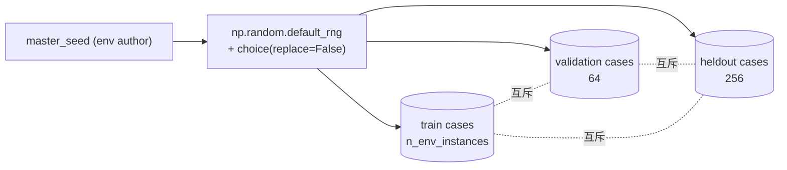
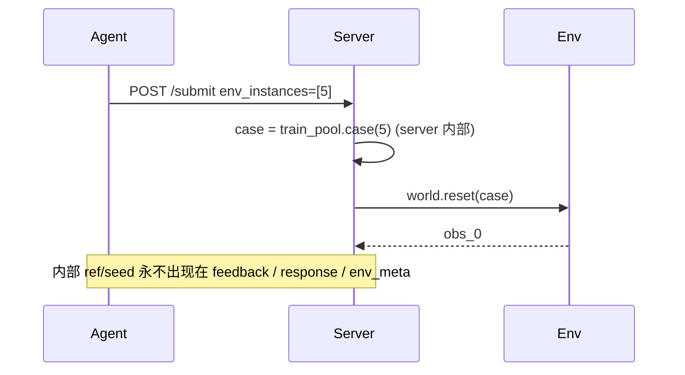
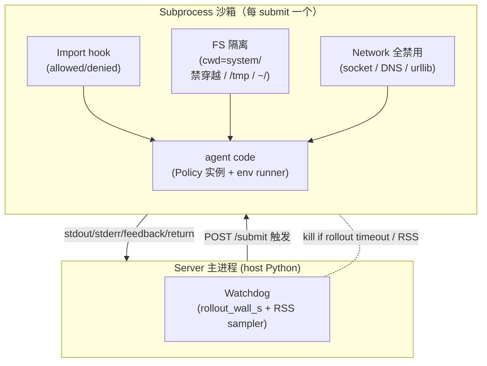

← [protocol index](./README.md)　|　← Previous: [§5 Submit 生命周期](./05-submit-lifecycle.md)

# §6 Case 池与沙箱

> 本章刻画 *三池 case 怎么生成、agent 看到什么、看不到什么；agent 代码在沙箱里跑时受哪些隔离与监控*。

## 6.1 三池总览

| 池 | 静态来源 | 大小 | Agent 可见性 |
|---|---|---|---|
| **Train** | run-specified data source | `env_meta.n_env_instances`（由 `train.json` 决定） | 仅 ID `[0, n_env_instances)`，内部 ref/seed 不可见 |
| **Validation** | run-specified data source | **64**（协议默认，可由 run 配置缩小用于 smoke） | 完全隐藏 |
| **Held-out** | run-specified data source | **256**（协议默认，可由 run 配置缩小用于 smoke） | 完全隐藏 |

三池 **全部静态**，但 case source 不属于 `src` 代码包。run 配置必须指向一个外部 data 目录；host 在 run 开始时读取 `train.json`、`valid.json`、`heldout.json`，并把三份文件的 SHA-256 写入 `run.json:versions`。run 期间文件内容不可变。case source 可以是 seed 表、dataset row、scenario 文件、level id，或其它可复现引用。

```
data_dir/
├── train.json      ← agent 可索引 ID, 内部 ref/seed 不暴露
├── valid.json      ← server 内部, 永不暴露
└── heldout.json    ← server 内部, 永不暴露
```

推荐 JSON 形状：

```json
{
  "env": "cartpole",
  "split": "train",
  "cases": [{"seed": 1001}, {"seed": 1002}]
}
```

## 6.2 Seed 派生与互斥保证

seed-backed benchmark data 可以由单个 `master_seed` 离线派生 3 池，保证 **disjoint**，然后把结果写入外部 data 目录：

```python
import numpy as np

def derive_pools(master_seed: int, n_train: int):
    rng = np.random.default_rng(master_seed)
    total = n_train + 64 + 256
    seeds = rng.choice(2**31, size=total, replace=False).tolist()
    return {
        "train":    seeds[:n_train],
        "validation": seeds[n_train : n_train + 64],
        "heldout":  seeds[n_train + 64 :],
    }
```

**`replace=False` 保证三池 pairwise disjoint**。对非 seed-backed 环境，等价要求是 train / validation / held-out 的真实 case 集合互斥，不能让 agent 调过的 case 出现在 hidden pools。



benchmark curator 在发布 data 目录时**必须**：

1. 在 data manifest 或 split metadata 中记录生成方法（如 `master_seed`，若适用）；
2. 提供 `train.json`、`valid.json`、`heldout.json` 三份 case source；
3. `evopolicygym check-envs` 和数据校验工具校验 disjoint 与大小一致；
4. 每次改动任一池 → 生成新的 data hash；若 env 逻辑也变更，再 bump `env_version`（[§9 版本管理](./09-versioning.md)）。

## 6.3 Case 间接寻址

Agent **永远** 通过 **整数 ID** 访问 train 池（`env_instances=[0, 5, 17, ...]`），**永远** 不见内部 ref/seed：



后果：

- **跨 run 可重复**：env_instance ID 5 在同一 `env_version` 与同一 data hash 下永远对应同一 underlying case → "agent A vs B on instance 5" 是 bit-exact 比较。
- **不可逆抽象**：`env_version` 升级可能改变 ID 5 的实际行为，agent 不必关心——它一直只看 ID。

Validation / held-out 没有"agent 可见的 ID 空间"——server 直接按 hidden pool 顺序遍历，agent 既看不到 ref/seed 也看不到 index。

## 6.4 Policy 端确定性

Seed-backed env 可以在每个 episode `Policy.reset(episode_index)` **之前**派生 deterministic RNG state：

- `random.seed(real_seed)`
- `numpy.random.seed(real_seed & 0xFFFFFFFF)`（影响 numpy 的 legacy 全局 API：`np.random.uniform` / `randn` / 等）

所以 policy 内部用 `random` / `numpy.random.*` 写出的随机决策可在同一 env_instance 下确定。非 seed-backed env 应提供等价的可复现 case source。

**不自动 seed 的库**（policy 自己负责）：

- `numpy` 的 **新 generator API**：`np.random.default_rng(...)` 是独立实例，不受全局 seed 影响 → policy 若用此 API **MUST** 自己管理 seed
- `torch` (`torch.manual_seed`)
- `jax`（pass key 显式管理）
- `tensorflow`、`scipy.stats`、其它带内部 RNG 的库

如果 policy 用了上述任一且要求确定性，**MUST** 在 `reset()` / `__init__` 里自己 seed（可从 `episode_index` 派生作 deterministic seed，但**不能**用真实 seed——它没暴露）。

## 6.5 沙箱总览

每次 submit 在一个**新 subprocess** 中执行 agent 代码，进程级隔离 + 可选 rollout watchdog：



子进程退出后整体回收；同 submit 内若 policy `subprocess.spawn` 子进程，子孙进程的 RSS 也计入 sandbox 内存统计。

## 6.6 资源限制实现

| 限制 | 实现机制 |
|---|---|
| `rollout_wall_s` | 可选，默认 `null`；Server 主进程 watchdog 只包 execute/eval rollout，超时即终止 sandbox |
| `memory_bytes` | 可选，默认 `null`；watchdog 或 OS/cgroup 统计 sandbox 进程及子进程内存，峰值超阈值即终止 |
| GPU | 协议**不约束**；env author 想用 GPU 需自行 export `CUDA_VISIBLE_DEVICES` 并在 env doc 声明 |

为什么 rollout timeout 放在 host watchdog？

- Agent 对 `/submit` 前的计划、LLM 和工具调用有主权，EvoPolicyGym 不应该在 agent 层限时。
- Rollout timeout 是粗粒度安全网，沙箱可能被 agent 代码阻塞掉自身 alarm，必须由 host 兜底。
- Per-step timeout 不属于基线协议；需要时作为 env-specific extension 明示。

## 6.7 Import 沙箱

[§3.4 Import 策略](./03-resources.md#34-import-策略) 已给规则；本节给实现要点。

### 双层检测

```
1. Snapshot 阶段（Phase 3 Validate）：
   AST 静态解析 system/ 内所有 .py，收集所有 import 语句
   → 命中 denied 立刻 fail（denied_import）
   → 出现非 allowed 第三方包 fail（denied_import，"默认 deny"）

2. Runtime 阶段（Phase 4-6）：
   subprocess 启动时安装 sys.meta_path[0] = ProtocolImportHook
   → 任何 import X 在 hook 里再校验一次
   → 命中 deny 抛 ImportError → 上层捕获为 denied_import 或 import_error
```

双层 = **静态防遗漏 + runtime 防绕过**（避免 `__import__("transformers")` / `importlib.import_module` 类动态 import 钻空）。

### `denied_imports` 默认清单

| 类别 | 包 | 拒绝理由 |
|---|---|---|
| HuggingFace 系 | `transformers`, `huggingface_hub`, `datasets`, `diffusers`, `accelerate` | 暗中走 Hub 下载、可能拉权重 |
| Tracking | `wandb`, `mlflow`, `tensorboard`（runtime 网络写入） | 网络外发 |
| HTTP 类 | `requests`, `urllib3`, `httpx`, `aiohttp` | 网络（与 §6.9 全禁用对齐） |
| 进程 spawn | `subprocess`, `multiprocessing.pool.Pool`, `os.system` | 绕沙箱、起辅进程 |
| 反射性 import | `importlib._bootstrap`, `pkgutil` | 绕过 import hook |

env author 可在此基础**追加**（不可删减）。完整 deny 表与 allow 表写在 env 注册元信息里，`/info:denied_imports` / `:allowed_imports` 返回最终生效集合。

### 不限制清单

- Python 标准库（除 `subprocess` 等显式 deny 项）
- agent 自己的子模块（`from controllers.pid import ...`，路径在 `system/` 内）

## 6.8 文件系统隔离

| 路径 | 权限 |
|---|---|
| `workspace/system/` | **读写**（agent 写代码、读 memory） |
| `workspace/feedback/` | agent **不可写**（read-only mount 或 hook 拦截） |
| `workspace/AGENTS.md` | agent **不可写** |
| `/tmp`, `/var`, `~` | **不可读不可写**（沙箱 cwd 不在此；`os.open` / `Path.write` 命中即 IOError） |
| `/proc`, `/sys` | **不可读** |
| `runs/.../`（含 checkpoints / logs） | agent **不可见**（在 sandbox 视野外） |

实现选项（按强度递增）：

1. **轻量**：`os.chdir(workspace/system/)`，依赖代码良知（v1 默认）
2. **中等**：Python 端 `open()` / `os.*` patching 拦截绝对路径
3. **强**：Linux `unshare(CLONE_NEWNS)` + bind mount `system/` rw, `feedback/`+其它 ro / 不可见

v2 协议要求**至少做到 (2)**，env 可声明对 (3) 的需求。

## 6.9 网络隔离

本节约束的是 **policy rollout sandbox**，不是外层 agent harness。Agent
必须通过 `GET /info`、`GET /task`、`POST /submit` 调用本地 HTTP API；这些
localhost 请求属于评测交互面。Server 在收到 `/submit` 后再把
`workspace/system/` 快照放入 runtime sandbox 执行。

policy runtime 中 **完全禁用**（**MUST**）：

- DNS lookup（`socket.gethostbyname` / `getaddrinfo` → fail）
- TCP / UDP socket（`socket.socket(...)` → fail）
- HTTP 客户端（`urllib.request` / `urllib.urlopen` 已隐含 fail，连同 `denied_imports` 里的 `requests` 等）
- 外发 IPC（Unix domain socket 仅允许 `/dev/null` 等）

实现：`socket` 模块全函数 raise `OSError("network disabled")`，或 Linux `unshare(CLONE_NEWNET)` 进入空 net namespace。

**无 localhost 例外**：policy 代码即使连接 `127.0.0.1` 也应失败。只有
外层 agent harness 能访问 EvoPolicyGym 暴露的本地 HTTP server。

## 6.10 反作弊清单（anti-hack）

agent **MUST NOT** 做以下任何一项；命中即 `denied_import` / `import_error` / 手动 verdict（具体到运行期再判）：

| 手段 | 防御 |
|---|---|
| 读 `feedback/submit_*/` 里 **未来** submit 的内容 | 时序上不存在；`feedback/` 在 agent 写代码时是过去的，未来 submit 还没跑 |
| 推断 `valid` / `heldout` ref/seed 或大小 | 完全不暴露；`/info` 不返回，`env_meta` 不传，summary 不含 |
| 反射 / dynamic import 绕黑名单 | runtime import hook 双重校验（§6.7） |
| 在 `__init__` 里 spawn 进程做训练 | `subprocess` 在 deny 列表 + 网络全禁；起子进程 RSS 计入 |
| 写 `feedback/` 篡改前轮记录 | FS 隔离 read-only |
| 通过 `/proc/self` 读 hidden ref/seed | `/proc` 不可读 |
| 利用 `signal` 关掉 timeout alarm | host watchdog 兜底 `rollout_wall_s` |
| 直接读 hidden case source | data 目录不在 `workspace/` 内、不在 sandbox 可见路径 |

> 不构成作弊但**应当**避免：
> - 在 policy 里写 `print` 海量调试 → 64 KB 截尾，自损可读性
> - 把大模型推理放进 `act()` 会拖慢 rollout；是否超时取决于 host 是否配置 `rollout_wall_s`

## 6.11 校验工具应该检查的 invariant

`evopolicygym check-envs` 和数据校验工具（env + data 健康度）**MUST** 验证：

1. `train.json` / `valid.json` / `heldout.json` 三池 case source 存在且 size 符合 run/env 期望
2. 三池 underlying cases pairwise disjoint
3. seed-backed data 的生成 metadata 可审计；三份文件的 SHA-256 进入 `run.json:versions`
4. `denied_imports` 至少包含 §6.7 默认清单
5. `allowed_imports` 不与 `denied_imports` 交集

run artifact checker（当前 Python API `evopolicygym.check.check`，run 健康度）**MUST** 验证：

6. submit 的所有 `env_instances` ∈ `[0, n_env_instances)`
7. feedback 中没有泄漏 hidden ref/seed / val 信息（grep `summary.json:*`、`trajectory.jsonl`）

---

← Previous: [§5 Submit 生命周期](./05-submit-lifecycle.md)　|　Next: [§7 打分](./07-scoring.md) →
