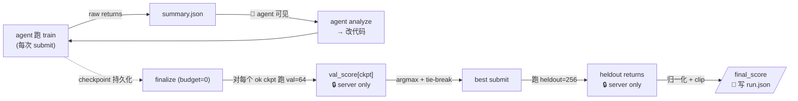

← [protocol index](./README.md)　|　← Previous: [§6 Case 池与沙箱](./06-seeds-sandbox.md)

# §7 打分

> 本章刻画 *一次 run 从原始 return 到 `final_score` 的全部计算、什么暴露给 agent、什么藏在 server*。

## 7.1 概览：四级分数

| 级 | 名称 | 算出来 | 落在哪 | Agent 可见 |
|---|---|---|---|---|
| 1 | **原始 return** | 单 episode 的 undiscounted return（env 的 `step:reward` 求和） | `trajectory.jsonl` 累计；`summary.json:returns[]` | ✅ in-loop submit 可见，其它不可见 |
| 2 | **per-submit 聚合** | `mean / std / min / max(returns)` 等 | `summary.json:{mean_return, std_return, ...}` | ✅ 仅 in-loop |
| 3 | **`val_score`** | `mean(val_returns)` per ok checkpoint | `run.json:outcome.val_scores[]` | ❌ run 期间不可见，run.json 落盘后可读 |
| 4 | **`final_score`** | `clip((heldout_mean - random) / (expert - random), 0, 1.2) × 100` | `run.json:outcome.final_score` | ❌ run 期间不可见，run.json 落盘后可读 |



**故意分离 val 与 final**：val_score 仅用于*选*，final_score 用于*分*。这让"选错策略"的风险（val ≠ heldout）独立可观测（[§7.5 `val_heldout_gap`](#75-auxiliary-metrics)）。

## 7.2 归一化公式

`final_score` 的归一化对齐 *random* 与 *expert* 两个 anchor：

```
normalized = (heldout_mean_return - random_baseline) / (expert_baseline - random_baseline)
final_score = clip(normalized, 0.0, 1.2) × 100
```

| 量 | 来源 | 含义 |
|---|---|---|
| `heldout_mean_return` | server 在 best ckpt 上跑 256 个 heldout episode 的 `mean(returns)` | 当前 run 的实际表现 |
| `random_baseline` | env 注册时**预先计算**（uniformly random policy 在同 256 heldout seed 上的 mean return） | "0 分" 锚点 |
| `expert_baseline` | env 注册时**预先发布**（参考实现 / 文献公开值） | "100 分" 锚点 |

**Clip 上下界**：

- 下界 `0`：跑出比 random 还差也归零（不让负分污染均值）。
- 上界 `1.2 × 100 = 120`：允许 super-expert 表现登记，但单点离群不爆方差。

**Sign-invariance**：归一化空间对正负 reward env 通用——Pendulum 的 `random=−1200, expert=−150` 与 HalfCheetah 的 `random=0, expert=8500` 经此公式后都是 `[0, 1.2]` 标度。

**故意不暴露给 agent**：`random_baseline` 与 `expert_baseline` 都是 env-internal，不在 `/info`、不在 `env_meta`、不在 `summary.json`、不在 `feedback/`。Agent 只能看到 raw `mean_return`，无法知道"离 expert 还差多少"。这迫使 agent 直接优化 return，而非"卡 expert 阈值"。

## 7.3 `val_score` 定义

`val_score` 是 **每个 ok checkpoint** 在 validation 集上的聚合：

```python
def val_score(checkpoint, val_pool):
    # server-internal, finalize-time
    val_returns = []
    for case in val_pool:   # len(val_pool) == 64
        ret = run_one_episode(checkpoint, case)
        val_returns.append(ret)
    return sum(val_returns) / len(val_returns)   # 简单算术平均
```

### 选择规则（与 [§1.5 规则 5](./01-overview.md#扣费规则) 对齐）

```
candidates = [submit_NNN for submit_NNN in all_submits if submit_NNN.status == "ok"]

if not candidates:
    final_score = 0
    run.json:outcome.status = "no_ok_submit"
    return

scores = {NNN: val_score(checkpoint_NNN, val_pool) for NNN in candidates}
best_NNN = argmax_with_tiebreak(scores, tiebreak=max_submit_index)  # 同分取最晚
```

**为什么用 raw mean 而非 normalized**：argmax 对线性变换不变，归一化与否选出的 best 完全一致。少做一步避免 baseline 泄漏。

**为什么用 mean 而非 median / LCB**：

- 与 in-loop convention 一致（`summary.json:mean_return` 也是 mean），agent 直觉可迁移。
- val pool 大小 64 已经足够稳健，不必再加 LCB 之类的方差惩罚。
- 简单 + 可重复。

## 7.4 `final_score` 流程

```
1. budget = 0 触发 finalize
2. candidates = all ok submits (per [§5 lifecycle](./05-submit-lifecycle.md))
3. if candidates 空 → final_score = 0, outcome.status = "no_ok_submit", goto 7
4. 对每个 candidate ckpt 跑 val=64 → val_scores[]
5. best = argmax_tiebreak(val_scores)
6. 用 best ckpt 跑 heldout=256 → heldout_returns[]
   final_score = clip((mean(heldout_returns) - random) / (expert - random), 0, 1.2) × 100
7. 写 run.json
```

### 边界情况

| 情况 | `final_score` | `outcome.status` |
|---|---|---|
| 至少一个 ok submit | 按公式 | `"completed"` |
| 全部 submit 失败 | `0` | `"no_ok_submit"` |
| Harness 中途崩溃 | `null`（部分写入 run.json） | `"error"` + `outcome.error` 描述 |
| 所有 ok ckpt val_score 都 = random | normalized ≤ 0 → clip 到 0 | `"completed"`（final_score = 0 ≠ no_ok_submit） |
| 所有 ok ckpt val_score 都 ≥ expert | normalized ≥ 1.2 → clip 到 120 | `"completed"`（final_score = 120） |

注意 **`no_ok_submit` ≠ `final_score == 0`**：

- `no_ok_submit`：agent 自始至终没有一次成功 submit（典型：每次都 `import_error`）
- `final_score == 0`：成功 submit 了但表现差到没归一化分

`run.json` 同时包含 `outcome.status` 与 `outcome.final_score`，分析者**应当**先看 status 再看分。

## 7.5 Auxiliary metrics

主分以外，每个 run 还报以下 metrics（写 `run.json:outcome.auxiliary.*`），**纯描述性，不参与选择**。

| Metric | 定义 | 用途 |
|---|---|---|
| `auc_in_loop` | 归一化空间下、in-loop `mean_return` 对累计 episode 数的梯形 AUC（anchor 在 `(0, 0)`），除以 `episode_budget` 后 ×100 | 学习曲线下面积；**同 budget 内**比较学习速度 |
| `episodes_to_50pct` | 首次出现 `normalized(mean_return) ≥ 0.5` 时的累计 episode 数；从未达到则 `null` | "走到中点要花多少 episode" |
| `episodes_to_80pct` | 同上，阈值 0.8 | "走到 expert 80% 要花多少" |
| `held_out_gap` | `mean_in_loop_best - mean_heldout_best` | 正 = in-loop 过拟合；负 = heldout 反而更好（典型噪声） |
| `val_heldout_gap` | `val_score(best) - mean_heldout(best)` | **`val` 选策略的可信度**：接近 0 表示 val 集预测准；远离 0 表示选策略环节噪声大 |
| `n_submits` | 总 submit 次数（含失败） | 行为统计 |
| `n_successful_submits` | `status == ok` 的 submit 数 | 实际候选池大小 |
| `episodes_used` | `Σ len(env_instances)` across all submits（含执行级失败）| 等于 `episode_budget - remaining_budget` |
| `mean_episodes_per_submit` | `episodes_used / n_submits` | 平均 batch 大小 |
| `mean_submit_wall_time` | 各 submit `wall_time_seconds` 的均值 | 性能 |
| `code_metrics_best` | best checkpoint 的 host-side 静态代码度量 | 工程性分析；不参与选择 |
| `code_metrics_by_submit` | `submit_index → metrics`，覆盖每次 snapshot | 观察结构随反馈迭代如何变化 |
| `code_metrics_trend` | 常用代码度量按 submit 顺序展开的序列 | 便于画复杂度/规模曲线 |

> **关于 `auc_in_loop`**：v2 finalize-time selection 之后，AUC 不再用于选 best，但仍是有用的 *学习速度* 描述符。**建议只在同 budget 内比较**（`(0, 0)` anchor 导致小 budget 结构性吃亏）。

> **`episodes_to_Npct` 的归一化定义**：v1 SPEC 初稿用 `mean ≥ 0.5 × expert`，对负 reward env（如 `expert = -150`）会错（`-75 > -150` 是"比 expert 更好"，不可达）。v2 用 `normalized(mean) ≥ 0.5`，对正负 reward 都对。

## 7.6 跨环境聚合（非规范）

每个 run 只 fixed 在一个 env 上，`run.json` 只出一个 `final_score`。**跨 env 聚合不在协议内**——是分析者 / leaderboard 的工作。

常用做法（仅供参考，不规范）：

- **算术平均**：对一组 env 的 `final_score` 取均值。已归一化到 `[0, 120]` 标度，算术平均直观；离群单 env 影响有限（被 0/120 截顶）。
- **几何平均**：对 `final_score + 1` 取几何均值再减 1，惩罚"某 env 拉胯整体也低"。论文里见过但不常用。
- **Per-env 表 + 排名**：完全不聚合，逐 env 报；保留 trade-off 信号。我们论文目前用这种（见 `archive/v1/exp.v1.md`）。

实现者**应当**让 `final_score` 单独可读，不预聚合到 run.json 顶层，便于下游随意组合。

## 7.7 故意不暴露给 agent 的字段（汇总）

| 字段 | 落在哪 | 暴露给 agent? |
|---|---|---|
| `random_baseline`, `expert_baseline` | env 注册元信息 | ❌ 永不（不在 `/info`、不在 `env_meta`、不在 `summary.json`） |
| hidden validation/heldout refs or seeds | external data directory | ❌ 永不（沙箱外文件，路径不可见） |
| `val_scores[]` per checkpoint | finalize 时计算 | ❌ run 期间不可见；run.json 落盘后才读得到 |
| `heldout_returns[]` | finalize 时计算 | ❌ 同上 |
| `final_score` | finalize 时计算 | ❌ 同上 |
| `best_submit_index` | finalize 时计算 | ❌ 同上 |

**Run 进行中 agent 能 query 的关于打分的所有信息** = `/info`（budget、submit 计数、`is_finalized`）+ `summary.json`（in-loop returns）。**仅此而已**。

## 7.8 `run.json:outcome` 字段一览

为后续 [§8 产物布局](./08-artifacts.md) 准备的字段清单：

```json
{
  "outcome": {
    "status": "completed" | "no_ok_submit" | "error",
    "error": null | "<message>",
    "final_score": 95.234,
    "best_submit_index": 7,
    "val_scores": {"0": -100.5, "1": -98.2, "7": -85.3, ...},
    "heldout_mean_return": -100.016,
    "heldout_std_return": 12.34,
    "heldout_returns": [-105.0, -98.0, ...],
    "auxiliary": {
      "auc_in_loop": 94.73,
      "episodes_to_50pct": 4,
      "episodes_to_80pct": 16,
      "held_out_gap": -1.6,
      "val_heldout_gap": 14.7,
      "n_submits": 9,
      "n_successful_submits": 7,
      "episodes_used": 64,
      "mean_episodes_per_submit": 7.1,
      "mean_submit_wall_time": 47.8,
      "code_metrics_best": {
        "source_lines": 84,
        "functions": 5,
        "cyclomatic_total": 14,
        "tree_hash": "sha256:..."
      },
      "code_metrics_trend": {
        "submits": [0, 1, 7],
        "source_lines": [21, 53, 84],
        "cyclomatic_total": [4, 9, 14]
      }
    }
  }
}
```

完整 schema 在 [§8](./08-artifacts.md)。

---

← Previous: [§6 Case 池与沙箱](./06-seeds-sandbox.md)　|　Next: [§8 产物布局](./08-artifacts.md) →
