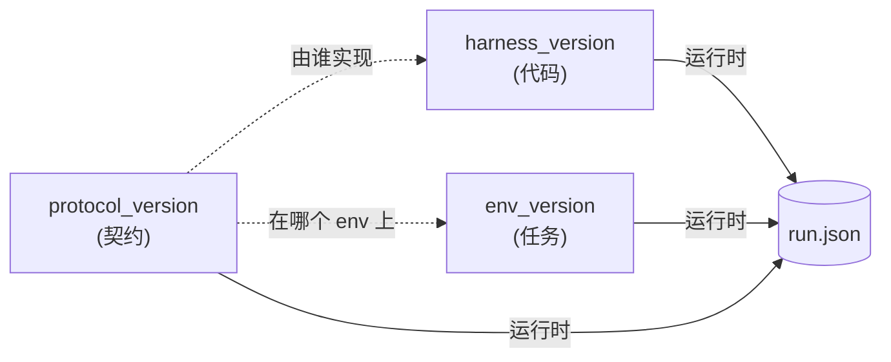
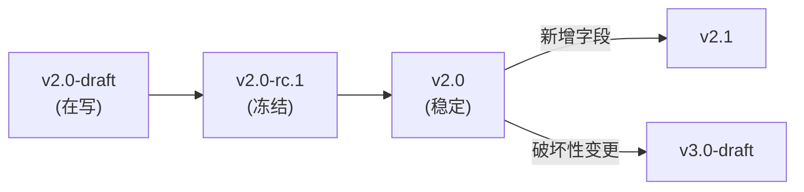

← [protocol index](./README.md)　|　← Previous: [§8 产物布局](./08-artifacts.md)

# §9 版本管理

> 本章刻画 *协议怎么演进、字段怎么加减、不同实现 / env / agent 如何在版本空间里互通*。

## 9.1 三类版本号

协议生态里有 **3 个独立** 的版本号，外加每次 run 绑定的 data hashes，**不可混淆**：

| 版本号 | 形态 | 写在哪 | 谁 bump |
|---|---|---|---|
| **`protocol_version`** | `protocol/vMAJOR.MINOR[-suffix]`，例 `protocol/v2.0` | `run.json:protocol_version`、`/info:schema_version`（关联） | 协议作者；改契约时 |
| **`harness_version`** | semver，例 `0.1.0` | `run.json:versions.harness` | hlbench 实现者；改代码时 |
| **`env_version`** | semver，例 `0.1` | `run.json:versions.env`、`/info:env_version` | env author；改 env 逻辑、reward、空间或任务文本时 |
| **`data_*_hash`** | SHA-256，例 `sha256:...` | `run.json:versions.data_train_hash` 等 | benchmark curator；改外部 split 文件时 |



三者**正交**：

- 一个 `harness_version` **可以同时支持多个 `protocol_version`**（典型：兼容 v1 与 v2 两套 schema）。
- 一个 `protocol_version` **可以由多个 `harness_version` 实现**（典型：参考实现 + 第三方实现）。
- `env_version` 与协议解耦：env 自己升级（改 reward / 加 obs）不需要改协议；仅改 case split 文件时记录新的 `data_*_hash`。

## 9.2 协议版本演进规则

`protocol/vMAJOR.MINOR[-suffix]`：

| 段 | 何时 bump | 后果 |
|---|---|---|
| **MAJOR**（v1 → v2） | **破坏性变更**：删字段 / 改语义 / 改默认值 / 改返回类型 / 添加新 endpoint | 旧 agent 无法直接跑新 server；需迁移 |
| **MINOR**（v2.0 → v2.1） | 加字段 / 加 endpoint / 加 verdict / 收紧约束以"更宽松一致" | 旧 agent 仍可跑新 server（忽略未知字段） |
| **`-draft` suffix** | 当前迭代版（如 `v2.0-draft`），字段还会变 | 不保证向后兼容；不允许进 production |
| **`-rc.N` suffix** | release candidate | 字段冻结，仅修正实现 bug |
| 无 suffix | stable | 冻结、不再改字段，仅 bug 修与文档微调 |

### 状态机



**只有 stable** 才允许在论文 / 评测 leaderboard 引用。

## 9.3 字段兼容规则

### 加字段（minor bump）

加字段对消费者**永远兼容**——旧 consumer 忽略未知键，新 consumer 写新字段。无需迁移。

例：v2.0 → v2.1 加 `outcome.auxiliary.val_score_variance`，旧分析脚本仍能跑。

### 弃用字段（minor → minor）

字段移除分两步：

```
v2.0   字段 X 存在，正常使用
v2.1   字段 X 仍存在，文档标注 [DEPRECATED since v2.1]，
       harness 仍写、读 X，但同时写新替代字段 X'
v2.2   字段 X 移除（这是破坏性变更）
       → 实际上这要求 v3.0，因为移除字段必须 MAJOR bump
```

**结论**：v2.x 之内 **MUST** "只增不减"；删字段必须 v3。`[DEPRECATED]` 标记是给 consumer 的迁移信号，不是删字段的捷径。

### 改语义（一律 MAJOR bump）

改字段含义（即使类型不变）= 破坏性 = MAJOR bump。例：v2 把 v1 的 `final_submit_index`（最后一次 ok）替换成 `best_submit_index`（val argmax）即典型 MAJOR 事件。

## 9.4 v1 → v2 破坏性变更（迁移表）

| 类别 | v1 行为 | v2 行为 | 迁移建议 |
|---|---|---|---|
| **Final policy 选择** | 最近一次 `status == ok` 的 submit | val_score argmax，tie-break 取最晚 | 跨版本评测分数不可比；应分别报 v1 / v2 列 |
| **Validation 集** | 不存在 | 引入 64 size hidden 集 + finalize 时统一跑 | v1 run 的"final"对应 v2 的"在 val 上分最高的 submit"，**不等价** |
| **Held-out 大小** | env 自定（默认 256） | **协议默认 256，env 一般不改** | 已有 env 若 != 256 须显式声明并文档化 |
| **Agent `/finalize`** | 暴露 | **删除** | v2 server 见到 `POST /finalize` 返 405 |
| **`run.json:outcome.status`** | `{completed, aborted, error}` | `{completed, no_ok_submit, error}` | "aborted" 在 v2 归 "error"；新增 "no_ok_submit" |
| **`run.json:outcome.final_submit_index`** | int | **重命名 → `best_submit_index`** + 新增 `val_scores` 字典 | 解析时检测两个字段都不存在则报错 |
| **`env_instances` 输入** | 仅 `int[]` | `int[]` 或 spec 字符串（"7-10,16-20"） | v2 server 兼容 v1 风格 `int[]`；v1 server 不接受 spec |
| **`run.json:protocol_version`** | 不存在 | **新增**，必填 | v1 → v2 适配器应注入 `"protocol/v2.0"` |
| **互斥规则例外** | `errors.txt` ⊕ `episodes/`（绝对） | `oom` / `rollout_timeout` 时**并存** | check 工具放宽 |

### v1 archive 路径

`archive/v1/docs/v1/` 保留 v1 spec 的完整版本，**冻结**、**不再改字段**。已经按 v1 跑出的实验结果有效，**不强制重跑**；引用时显式标 `protocol/v1`。

## 9.5 实现 ↔ 协议兼容矩阵

`harness_version` 声明它支持哪些 `protocol_version`：

```python
# 假想的 hlbench 0.2.0 声明
SUPPORTED_PROTOCOLS = ["protocol/v1", "protocol/v2.0"]
```

`run.json:protocol_version` 是 **运行时实际遵循** 的协议（client / agent / env 共同选定一致版本，server 写入）。**MUST**：

1. `protocol_version` ∈ harness 声明的支持列表（否则 run 启动即报错）
2. agent / harness / env / consumer 全部以同一 `protocol_version` 解读 run

跨版本互通示例：

| harness 支持 | env 写于 | agent 期望 | 结果 |
|---|---|---|---|
| `[v1, v2]` | `v1` | `v1` | ✅ run as v1 |
| `[v1, v2]` | `v2` | `v2` | ✅ run as v2 |
| `[v2]` | `v1` | `v1` | ❌ harness 报 unsupported |
| `[v1]` | `v2` | `v2` | ❌ env 写的字段 harness 不认（如 val pool） |

## 9.6 schema_version vs protocol_version

**易混淆点**：JSON 文件级 `schema_version` 与协议级 `protocol_version` **是两个东西**。

| 字段 | 粒度 | 例 | 何时 bump |
|---|---|---|---|
| `schema_version` | 单个 JSON 文件 | `run.json:schema_version = "0.1"` | 该文件内字段加减时（如 run.json 新增字段） |
| `protocol_version` | 整个协议 | `run.json:protocol_version = "protocol/v2.0"` | 协议契约改变时（含语义、endpoint、字段加减组合） |

通常 protocol bump 会带动多个 schema 文件 bump（`run.json` / `summary.json` / `_meta.json` / `/info`）。但单纯加一个无关字段不一定 bump 整个协议——schema_version + protocol_version 双轨记录给 consumer 更细粒度。

## 9.7 校验工具检查项

`hlbench check` **MUST** 验证：

1. `run.json:protocol_version` 形如 `protocol/v[0-9]+\.[0-9]+(-[a-z0-9.]+)?`
2. `run.json:protocol_version` 在当前 hlbench 实现的支持列表内
3. `run.json:schema_version` 与该 protocol_version 文档约定的一致
4. v2.x run **MUST NOT** 出现 v1 字段（如 `final_submit_index` 单独存在而无 `best_submit_index`）
5. 含 `[DEPRECATED]` 字段时记 warning（不 fail）

## 9.8 Future（非规范）

下面是 v3 候选改动的草稿，**仅备查、不构成承诺**：

| 候选 | 动机 |
|---|---|
| 暴露 `state.best_submit_index_so_far` 给 agent | 让 agent 知道 server 心目中目前的 best，避免预算浪费在已被 dominated 的方向 |
| 多 env / 多任务 single run | 跨 env 知识转移评测 |
| Async submit（agent 排队，并行执行） | 大 budget 下加速 |
| GPU 资源声明 | env 级 `requires_gpu`，跑大模型 inference |
| Agent 端 query "我的代码现在在 val 上排第几" | 缩 information gap，有作弊风险 |

每条进 v3 时都需要经过 §9.2 流程：`v3.0-draft` → `v3.0-rc` → `v3.0`。

---

← Previous: [§8 产物布局](./08-artifacts.md)　|　Back to [protocol index](./README.md)
