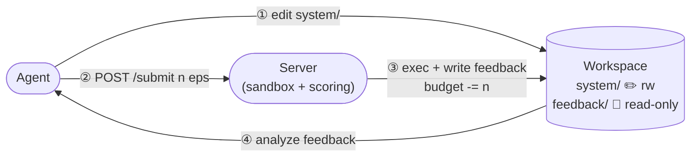

# EvoPolicyGym Protocol — 总览

> **状态**：草稿，逐章迭代中。本目录为协议规范文档（normative spec）；教程、示例、设计 rationale 在别处。
>
> **取代**：`archive/v1/docs/v1/SPEC.md` + `archive/v1/docs/v1/submit-protocol.md` + `archive/v1/docs/v1/output.md`。

---

## 协议定位

EvoPolicyGym 评测 **agent 从环境反馈中迭代代码策略（方法不限）** 的能力：

- **闭环**：agent 写代码 → server 沙箱执行 → 写回反馈 → agent 据此改代码，反复。
- **预算受限**：每个 run 有固定 `episode_budget`；agent 自决分配。
- **方法不限**：agent 提交的是 Python 代码，内部用 PD / PPO / 搜索 / 规划 / NN 均可。
- **三层 case 池**：**train**（可见，迭代用）→ **validation**（隐藏，server 选 best）→ **held-out**（隐藏，给 best 打最终分）。

## 一图全景

整套协议只有三个概念：**Agent / Server / Workspace**。完整流程、接口、预算见 [§1](./01-overview.md)。

## 章节目录

| # | 章节 | 一句话 | 状态 |
|---|---|---|---|
| §1 | [评测流程纵览](./01-overview.md) | 三方角色 · 生命周期 · 3 个 HTTP 接口 · 预算 · 3 层 case 池 | ✅ 已写 |
| §2 | [Policy 接口](./02-policy.md) | `Policy` 类契约 · `system/` 项目结构 · 状态持久化 · 错误模型 | ✅ 已写 |
| §3 | [资源限制](./03-resources.md) | 可选 rollout timeout + 内存 + import；超限处置一览 | ✅ 已写 |
| §4 | [Feedback schema](./04-feedback.md) | `summary.json` / `trajectory.jsonl` / `video.mp4` / `observations.npy` 全字段 | ✅ 已写 |
| §5 | [Submit 生命周期](./05-submit-lifecycle.md) | 7 阶段流程 · verdict 枚举 · 校验顺序 | ✅ 已写 |
| §6 | [Case 池与沙箱](./06-seeds-sandbox.md) | train / val / test 生成与互斥 · subprocess 隔离 · import hook | ✅ 已写 |
| §7 | [打分](./07-scoring.md) | `val_score` / `final_score` / 归一化公式 / auxiliary metrics | ✅ 已写 |
| §8 | [产物布局](./08-artifacts.md) | `run.json` schema · `checkpoints/` · `logs/` | ✅ 已写 |
| §9 | [版本管理](./09-versioning.md) | `protocol/v2.x` 兼容规则 · 字段加减约定 | ✅ 已写 |

## 非规范文档

| 文档 | 用途 |
|---|---|
| [Roadmap](../roadmap.md) | 实现路线、冻结边界、可扩展点与 release gate |

## 参考规范

| 文档 | 用途 |
|---|---|
| [Schema Reference](./schema.md) | `obs_space` / `action_space` / feedback value 的紧凑 schema 解释 |

## 推荐阅读路径

| 你是 | 顺序 |
|---|---|
| 想跑评测的 **agent 作者** | §1 → §2 → §3 → §4 → §5 |
| 实现 / 移植 **server** 的开发者 | §1 → §5 → §3 → §6 → §4 → §8 → §7 → §9 |
| 引用结果的 **论文读者** | §1 → §7 → §6 |
| 想升级到 v3 / 改字段的 **协议作者** | §9 → 各章 |

## 关键词约束（RFC 2119 中文）

| 英文 | 中文 | 含义 |
|---|---|---|
| MUST / SHALL | **必须** | 实现强制；违反即不合规 |
| MUST NOT | **禁止** | 实现强制禁止 |
| SHOULD | **应当** | 推荐做法；偏离需文档化理由 |
| MAY | **可以** | 可选 |

## 版本

| 协议版本 | 状态 |
|---|---|
| `protocol/v1` | 冻结，仅 bug 修；对应 `archive/v1/docs/v1/` |
| `protocol/v2.0-draft` | **本目录当前版本**，逐章迭代中 |
